<div align="center">

# 🛡️ GigEase
## AI-Powered Parametric Income Protection for Gig Workers

> *"When the flood hits, the money arrives first."*

**India's First Zero-Touch Parametric Insurance Platform for Food Delivery Partners**


| Platform | Coverage | Payout Speed | Premium |
|:---:|:---:|:---:|:---:|
| Zomato / Swiggy | STFI + RSMD Combined | **Under 10 minutes** | ₹25–₹250/week |

**Team:** Abijith U · Tarun Aadarsh B · Priyadharshini · Monish M
**Institution:** Chennai Institute of Technology

</div>

---

## 📦 Final Submission Package

| Deliverable | Link | Status |
|---|---|---|
| 🎬 **Phase 3 Demo Video (5 min)** | `[ADD YOUR PHASE 3 VIDEO LINK HERE]` | ⏳ Upload before April 17 |
| 📊 **Final Pitch Deck (PDF)** | https://drive.google.com/file/d/14ix5F6Q2dUPkAYkqDYGih2rvi_ccVFl-/view?usp=drivesdk | ⏳ Upload before April 17 |
| 📊 **GigEase Final Documentation - Project Guide (PDF)** | https://drive.google.com/file/d/1AS7BuFD8qWVkgL90dRts0fstnaidBkqN/view?usp=drivesdk | ⏳ Upload before April 17 |
| 🎬 **Phase 2 Demo Video** | [▶ Watch on YouTube](https://youtu.be/W9BuAyNVfU8?si=SQ-h_7hhknkECGSw) | ✅ Submitted |
| 📁 **All Project Documents & Assets** | [📂 Google Drive](https://drive.google.com/file/d/1AS7BuFD8qWVkgL90dRts0fstnaidBkqN/view?usp=drivesdk) | ✅ Public |
| 💻 **Source Code** | [GitHub Repository](https://github.com/Abijith-U0245/GigEase_AI_Insurance_Platform) | ✅ Public |

### Pitch Deck
> **[[ADD YOUR PITCH DECK LINK HERE](https://drive.google.com/file/d/14ix5F6Q2dUPkAYkqDYGih2rvi_ccVFl-/view?usp=drivesdk)]**
> *(Upload to Google Drive or any publicly accessible platform and paste the link above)*

---

## Table of Contents

1. [What GigEase Is](#1-what-gigease-is)
2. [Phase 3 Deliverables — What's New](#2-phase-3-deliverables--whats-new)
3. [Advanced Fraud Detection](#3-advanced-fraud-detection--gps-spoofing--fake-weather-claims)
4. [Instant Payout System](#4-instant-payout-system--simulated)
5. [Intelligent Dashboard](#5-intelligent-dashboard)
6. [The Complete System](#6-the-complete-system--8-layers-a-to-h)
7. [Registration Process](#7-registration-process)
8. [Insurance Policy — STFI + RSMD](#8-insurance-policy--stfi--rsmd)
9. [Dynamic Premium — ML Engine](#9-dynamic-premium--ml-engine)
10. [Claims Management — 13 Steps](#10-claims-management--13-steps)
11. [5 Automated Triggers](#11-5-automated-triggers)
12. [Database Architecture](#12-database-architecture)
13. [Security & Blockchain](#13-security--blockchain)
14. [IRDAI & Regulatory Compliance](#14-irdai--regulatory-compliance)
15. [Quick Start — Run Locally](#15-quick-start--run-locally)
16. [API Reference](#16-api-reference)
17. [Tech Stack](#17-tech-stack)
18. [Key Numbers](#18-key-numbers)

---

## 1. What GigEase Is

India has **15 million gig economy delivery workers** across Zomato, Swiggy, Zepto, and Amazon. They have no fixed salary, no paid leave, no employer insurance, and no income guarantee. During a cyclone, a flood, or a city-wide bandh — they earn ₹0.

**GigEase solves this with one architectural decision:**

Instead of asking riders to *prove* their loss, the system uses objective real-world data to detect when a qualifying disruption occurred, calculate the exact income shortfall, score fraud across 17 independent checks, and credit the worker's UPI account — without a single human in the loop.

> $$\text{Trigger: } W_{\text{actual}} < 0.60 \times W_{\text{expected}}$$
>
> $$\text{Payout} = \min\left(\beta \times (W_{\text{expected}} - W_{\text{actual}}),\ S\right)$$
>
> where $\beta = 0.75$ (STFI) or $\beta = 0.65$ (RSMD), and $S = \text{clamp}(1.5 \times W_{\text{avg}},\ ₹3{,}000,\ ₹15{,}000)$

**10 minutes. Zero forms. Zero calls. Zero waiting.**

---

## 2. Phase 3 Deliverables — What's New

*Theme: "Perfect for Your Worker"*

| Phase 3 Requirement | GigEase Implementation | Section |
|---|---|---|
| **Advanced Fraud Detection** | 4-layer physics-based scoring: accelerometer fusion, cell tower triangulation, Isolation Forest behavioral analysis, DBSCAN syndicate detection | [Section 3](#3-advanced-fraud-detection--gps-spoofing--fake-weather-claims) |
| **Instant Payout (Simulated)** | Razorpay test mode + NPCI UPI sandbox + 5-table atomic DB write. Worker credited within 10 minutes of trigger. | [Section 4](#4-instant-payout-system--simulated) |
| **Worker Dashboard** | Real-time earnings protected, coverage status, NCD tracker, 5 automatic notification types | [Section 5](#5-intelligent-dashboard) |
| **Admin/Insurer Dashboard** | Live loss ratios, ICR health, predictive next-week weather risk, fraud audit log, trigger simulator | [Section 5](#5-intelligent-dashboard) |
| **5-min Demo Video** | Screen-capture walkthrough: disruption trigger → AI claim approval → UPI payout | [Submission Package](#-final-submission-package) |
| **Final Pitch Deck** | 17 slides: persona, AI architecture, fraud system, business viability, IRDAI compliance | [Submission Package](#-final-submission-package) |

---

## 3. Advanced Fraud Detection — GPS Spoofing & Fake Weather Claims

> *"We built a system where the flood itself protects honest workers — not punishes them."*

### The Core Problem

GPS spoofing is the primary fraud vector in parametric insurance. A fraudster installs a fake GPS app, places their coordinates inside a flood zone, and claims a payout while sitting safely at home. Without robust defenses, a Telegram-coordinated ring of 500 fake riders could drain an entire liquidity pool in hours.

### The Unbreakable Principle — Physics Over Software

A GPS spoofing app operates at the Android OS software layer. It **cannot**:

- Change which cell tower the phone physically connects to *(radio physics)*
- Alter accelerometer readings *(gravity is always ≈9.81 m/s² on a stationary object)*
- Fake natural GPS signal degradation from monsoon rain *(heavy cloud attenuates satellite reception)*
- Coordinate 500 spoofing apps to produce naturally varied, non-synchronized behavior

**The key physics check:**

$$\text{Accel Magnitude} = \sqrt{x^2 + y^2 + z^2}$$

> A stationary phone = **9.81 m/s²** (gravity only).
> A phone moving at 30 km/h = **higher** (road vibration + acceleration).
> GPS claims movement at 30 km/h but accelerometer reads 9.81 → **GPS is being spoofed.**

### 4-Layer Fraud Scoring Pipeline

$$\text{Fraud Score} = 0.40 \cdot L_1 + 0.30 \cdot L_2 + 0.15 \cdot L_3 + 0.15 \cdot L_4$$

Override rule: if $L_1 > 0.85$ OR $L_2 > 0.90$ → $\text{score} = \max(\text{score},\ 0.75)$

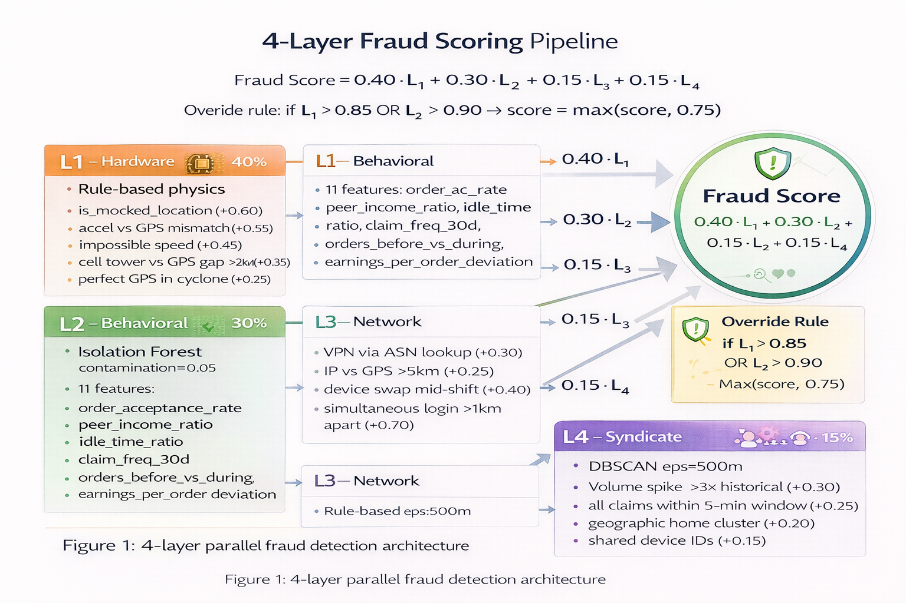
*Figure 1: 4-layer parallel fraud detection architecture*

| Layer | Algorithm | Weight | Key Signals |
|---|---|:---:|---|
| **L1 — Hardware** | Rule-based physics | **40%** | `is_mocked_location` (+0.60), accel vs GPS mismatch (+0.55), impossible speed (+0.45), cell tower vs GPS gap >2km (+0.35), perfect GPS in cyclone (+0.25) |
| **L2 — Behavioral** | Isolation Forest `contamination=0.05` | **30%** | 11 features: `order_acceptance_rate`, `peer_income_ratio`, `idle_time_ratio`, `claim_freq_30d`, `orders_before_vs_during`, `earnings_per_order_deviation` |
| **L3 — Network** | Rule-based | **15%** | VPN via ASN lookup (+0.30), IP vs GPS >5km (+0.25), device swap mid-shift (+0.40), simultaneous login >1km apart (+0.70) |
| **L4 — Syndicate** | DBSCAN `eps=500m` | **15%** | Volume spike >3× historical (+0.30), all claims within 5-min window (+0.25), geographic home cluster (+0.20), shared device IDs (+0.15) |

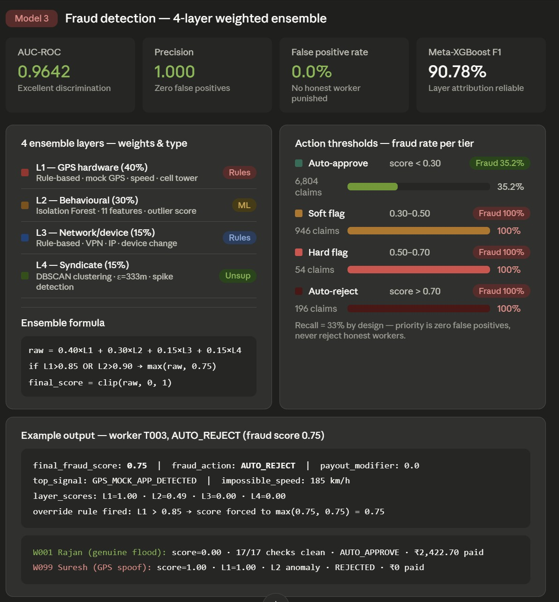

### Action Gate

| Score | Action | Payout |
|:---:|:---:|---|
| **< 0.30** | ✅ AUTO APPROVE | 100% via UPI within 10 minutes |
| **0.30–0.50** | 🟡 SOFT FLAG | 50% now + 50% held pending WhatsApp photo verify |
| **0.50–0.70** | 🟠 HARD FLAG | Full hold — human review within 7 days |
| **> 0.70** | ❌ AUTO REJECT | 30-day appeal window, IRDAI escalation path |

### The GPS Degradation Inversion Rule

Standard fraud logic penalises poor GPS. GigEase **inverts this** for verified disaster events:

| GPS Condition During Verified STFI Event | Treatment | Score |
|---|:---:|:---:|
| GPS accuracy ±120m during cyclone | **Expected — genuine rain signal** | `0.00` |
| GPS gap of 30–60 min during peak rainfall | **Expected — tower congestion** | `0.00` (marked `data_gap_verified`) |
| GPS accuracy ±5m during cyclone | **Suspicious — synthetically generated** | `+0.25` |
| Perfect GPS coordinates in confirmed flood zone | **Very suspicious** | `+0.35` |

### Two Claims — Same Event — Zero Human Decisions

| Signal | Rajan K (Genuine, Velachery) | Suresh M (Spoofer, T Nagar) | Score Added |
|---|---|---|:---:|
| `is_mocked_location` | FALSE on all 20 pings | TRUE on 14/20 pings | +0.60 |
| Accel vs GPS | Both stationary — consistent | GPS moving, accel 9.81 m/s² static | +0.55 |
| Cell tower vs GPS | C-VLY-04 = Velachery ✓ | T-NGR-07 = T Nagar, 6.2km off ✗ | +0.35 |
| GPS accuracy in storm | ±120m — rain-degraded (genuine) | ±5m — suspiciously perfect | +0.25 |
| Zone-weather cross-check | All signals agree ✓ | Cell tower = dry area ✗ | +0.80 |
| Pre-event acceptance | 100% Mon–Tue — normal | Refused 11 orders deliberately | +0.30 |
| **Final Score** | **0.00 → AUTO APPROVE → ₹2,595 credited** | **1.00 → REJECTED in 60 seconds** | |

### Circuit Breaker — Pool Protection Against Fraud Rings

When zone claim spike exceeds **3× historical average:**

```
1. All claims from that zone → QUEUED (not rejected)
2. DBSCAN analysis runs within 5 minutes (Celery async)
3. Geographically distributed genuine claims → RELEASED (paid within 2 hours)
4. Tight geographic home clusters → HARD FLAGGED (human review)
5. Honest riders receive: "Your claim is under verification. Payment within 2 hours."
```

### GPS Distance Fraud Deduction

For kilometer-inflation fraud (fraudsters claim longer delivery distances):

$$\text{fraud\_deduction} = (\text{GPS\_distance} - \text{cell\_tower\_distance}) \times ₹4.5/\text{km}$$

Applied only when `GPS_distance > cell_tower_distance × 1.30`

---

## 4. Instant Payout System — Simulated

### Razorpay Test Mode Integration

```python
# services/razorpay_service.py
import razorpay, os

client = razorpay.Client(
    auth=(os.getenv("RAZORPAY_KEY_ID"), os.getenv("RAZORPAY_KEY_SECRET"))
)

def initiate_payout(upi_id: str, amount_inr: float, claim_id: str) -> dict:
    amount_paise = int(amount_inr * 100)  # NPCI is paise-denominated — always integer
    transfer = client.transfer.create({
        "account":      upi_id,
        "amount":       amount_paise,
        "currency":     "INR",
        "mode":         "UPI",
        "purpose":      "insurance_claim",
        "narration":    f"GigEase claim {claim_id}",
        "reference_id": claim_id          # idempotency key — prevents double payment
    })
    return {
        "success":     True,
        "razorpay_id": transfer.get("id"),
        "status":      transfer.get("status"),
        "amount_inr":  amount_inr,
        "utr":         transfer.get("utr", f"DEMO{claim_id[-6:].upper()}")
    }
```

### The 5 Automatic Notifications — Worker Receives Without Opening App

```
┌──────────────────────────────────────────────────────────┐
│  📩  CLAIM DETECTED                         06:01 AM     
│  "Flood alert in Velachery. Your claim is being          
│   processed automatically — no action needed."           
├──────────────────────────────────────────────────────────┤
│  💸  PAYOUT CREDITED                        06:11 AM     
│  "₹2,595 credited to rajan.k@upi.                       
│   UTR: RZNP20251105. Claim ID: CLM-W001-STFI"           
├──────────────────────────────────────────────────────────┤
│  🔔  PREMIUM DEDUCTED                       Every Mon    
│  "Your weekly premium of ₹89 has been auto-deducted     
│   from your Zomato earnings. Coverage active."          
├──────────────────────────────────────────────────────────┤
│  💰  SALARY PROTECTED                       Same day     
│  "Bandh disruption detected. ₹1,739 added to your      
│   account automatically."                               
├──────────────────────────────────────────────────────────┤
│  🏅  NCD UPDATED                            Every Sun    
│  "3 clean weeks completed. Your premium drops to        
│   ₹82 from next Monday. Keep going!"                    
└──────────────────────────────────────────────────────────┘
```

*Every message above is sent without the worker ever opening the app, filing a form, or making a call.*

### 10-Minute Payout Timeline — Cyclone Dana, Velachery

| Time | Event |
|---|---|
| `02:30 AM` | Cyclone Dana makes landfall. IMD alert ingested within 1 min. |
| `06:00 AM` | OpenWeatherMap: 187mm rain · NDMA: flood level 4 · Google Maps: congestion 0.97 |
| `06:01 AM` | Trigger fires `EVT-STFI-20251105-Z001`. 47 riders identified in <5 sec. |
| `06:02 AM` | Agent 1 (Work History) starts — GPS, accelerometer, behavioral checks |
| `06:04 AM` | Agent 2 (KYC/Finance) starts in parallel — DigiLocker + policy + NPCI |
| `06:04 AM` | Agent 1 completes. Score: **0.04 — PASS** |
| `06:06 AM` | Agent 2 completes. Score: **1.00 — PASS** |
| `06:06 AM` | Agent 3: all 17 fraud checks. Score: **0.00 — AUTO APPROVE** |
| `06:07 AM` | Agent 4: payout ₹2,595.75 calculated. Pool check passed. Razorpay API called. |
| `06:09 AM` | NPCI processes UPI transfer. UTR: `RZNP2025110500000142` |
| **`06:11 AM`** | **₹2,595.75 credited. 5 DB tables updated atomically. Blockchain recorded.** |
| **TOTAL** | **10 minutes. Worker did: nothing.** |

### Atomic 5-Table Write — After Razorpay Confirms

```python
with conn.transaction():
    insert_claim(claim_id, worker_id, payout_amount, fraud_score)
    update_policy_loading(policy_id, loading_pct=5, ncd_reset=True)
    update_worker_claim_count(worker_id)
    update_pool_balance(payout_amount)
    insert_fraud_log(all_17_checks, overall_score)
# If Razorpay succeeds but DB fails → retry is safe (Razorpay payout ID is idempotent)
# If DB succeeds but Razorpay fails → POST /v1/refunds triggered automatically
```

---

## 5. Intelligent Dashboard

### Worker Dashboard — "What Deepa Sees at 6 AM"

```
╔══════════════════════════════════════════════════════════╗
║  Hey Deepa 👋                          Swiggy Partner   
╠══════════════════════════════════════════════════════════╣
║  THIS WEEK                                               
║  Earnings Earned:   ₹4,312    Coverage: ₹6,750 ✓        
║  Income Protected:  ₹3,847    Policy:   ACTIVE          
║  Threshold:         ₹2,700    NCD:      6% (3 clean wks)
╠══════════════════════════════════════════════════════════╣
║  ⚡  FLOOD ALERT — Velachery                            
║     Your claim is processing. No action needed.         
╠══════════════════════════════════════════════════════════╣
║  Protection Score: ████████████████████░░  94/100       
║  Next Premium: ₹79.23 deducted Monday                   
╠══════════════════════════════════════════════════════════╣
║  RECENT ACTIVITY                                         
║  ✅ ₹2,595 credited (Flood — Nov 5)                     
║  🔔 ₹89 premium deducted (Nov 4)                        
║  🏅 NCD updated to 6% (Nov 3)                           
╚══════════════════════════════════════════════════════════╝
```

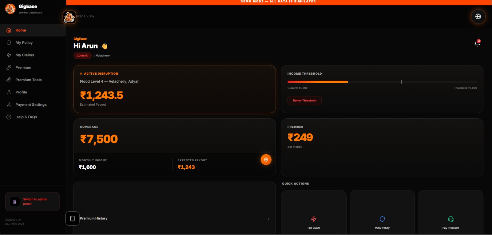
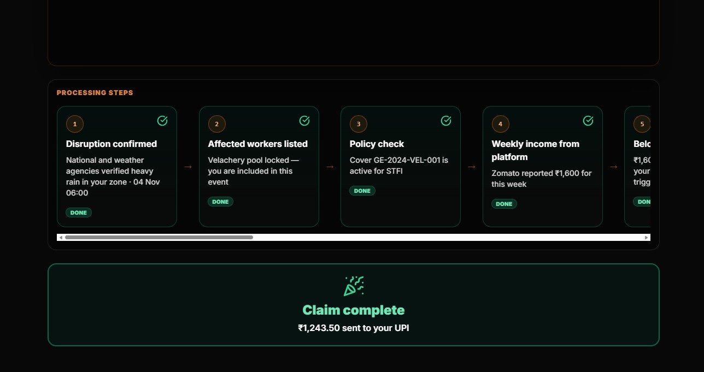
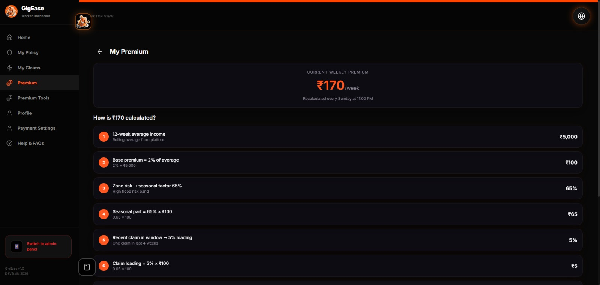
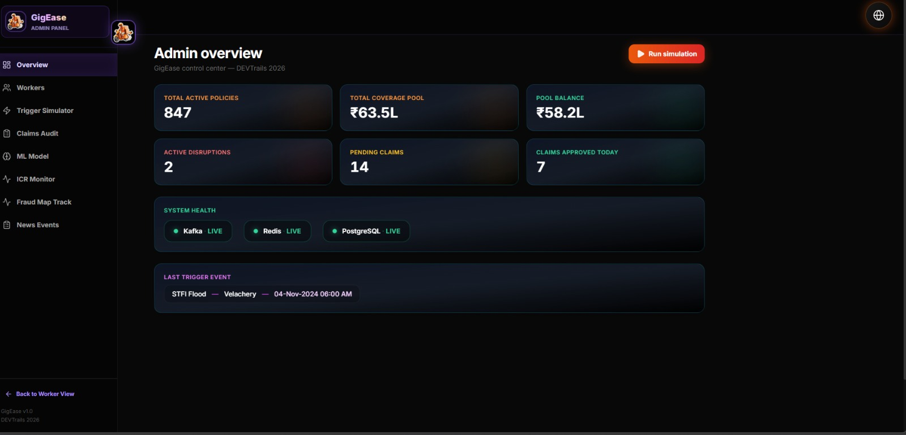
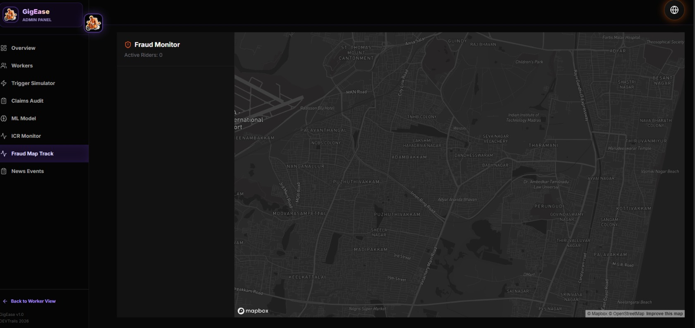
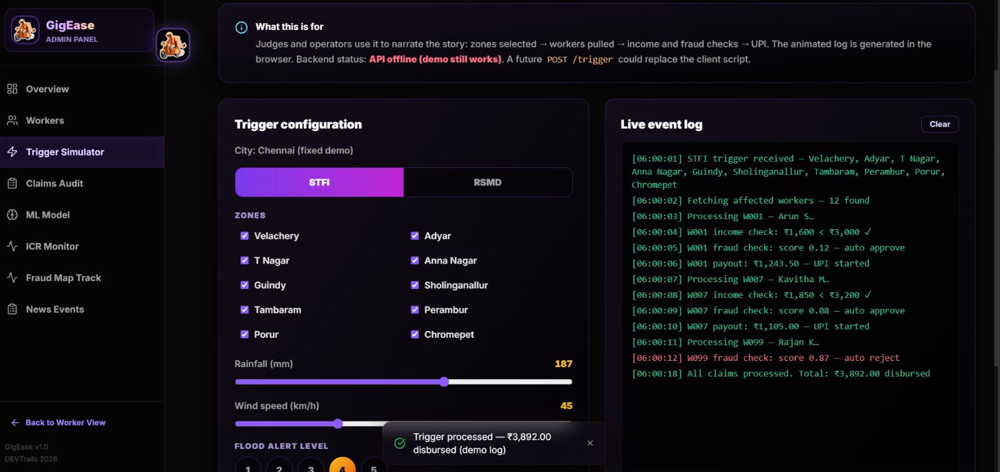
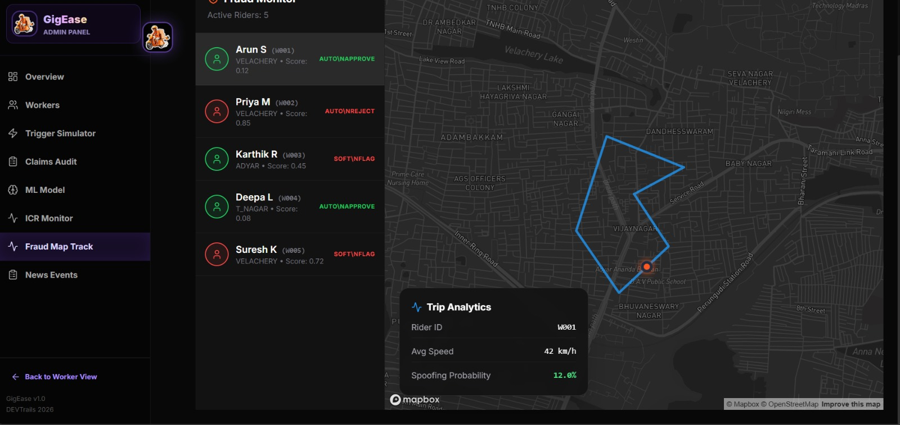

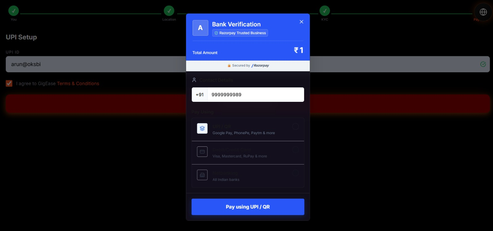
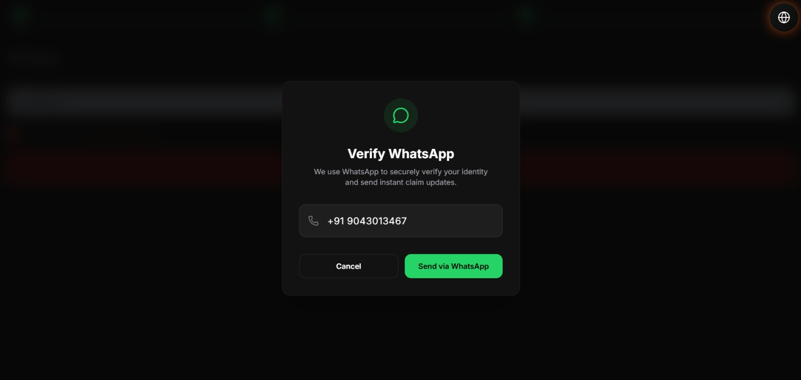

*Figure 2: GigEase Worker App — Home, Policy, Claims, Analytics, and Alerts screens*

**The 5 screens (P1–P5):**
- **Home:** Weekly earnings vs protected income bar, active disruption alert banner, NCD progress
- **Policy:** STFI + RSMD coverage details, trigger thresholds, next renewal date
- **Claims:** 13-step automated pipeline tracker (like a food delivery status), no filing required
- **Analytics:** 7-day earnings chart, Protection Score, zone safety rating
- **Alerts:** All 5 automatic notification types, each with timestamp and deep-link

### Admin / Insurer Dashboard — "What GigEase Operations Sees"

```
╔══════════════════════════════════════════════════════════╗
║  GIGEASE OPERATIONS DASHBOARD                            
╠══════════╦══════════╦══════════╦═════════════════════════╣
║ Pool:    ║ ICR:     ║ Active   ║ Fraud Today:           
║ ₹42.87L  ║ 64.2%   ║ Policies:║ Flagged: 3             
║ ✓ >30%  ║ ✓HEALTHY ║ 1,247    ║ Rejected: 1            
╠══════════╩══════════╩══════════╩═════════════════════════╣
║  PREDICTIVE — NEXT WEEK RISK                             
║  Chennai   ████████████████████ 0.78  HIGH  (monsoon)   
║  Delhi     ████████████ 0.48         MEDIUM (heat)      
║  Mumbai    █████████ 0.37            LOW                 
║  Kolkata   ███████ 0.31              LOW                 
╠══════════════════════════════════════════════════════════╣
║  LOSS RATIO TREND (12 months)                            
║  Jan ██ 48%  Apr ███ 55%  Jul ████ 67%  Oct █████ 79%  
║  ICR auto-adjusted: λ += 0.2% (Oct warning zone)       
╠══════════════════════════════════════════════════════════╣
║  CLAIMS TODAY: 47 total                                  
║  Auto-approved: 44  |  Soft-flagged: 2  |  Rejected: 1  
║  Avg processing time: 8.4 minutes                        
╠══════════════════════════════════════════════════════════╣
║  [🌩 Trigger Simulator] [📊 ICR Monitor] [🔍 Fraud Log] 
╚══════════════════════════════════════════════════════════╝
```

**Admin-only features:**

```
Trigger Simulator      → Fire any of 5 disruption types for any city
                          Preview: affected workers + estimated total payout
                          Confirm dialog before firing → live event log updates

ICR Monitor            → Live ICR with auto-adjustment history
                          Monthly trend bar chart (12 months)
                          Manual rate override (admin only, logged to audit)

Fraud Audit Log        → All claims with 17-check fraud log expandable per claim
                          W001 demo shortcut (Rajan — genuine, score 0.00)
                          W099 demo shortcut (Suresh — spoofer, score 1.00)
                          Export CSV for IRDAI compliance filing

ML Model Dashboard     → XGBoost feature importances (live bar chart)
                          Last training date + dataset size
                          Airflow DAG status (sunday_ml_premium_update)
                          Redis feature snapshot preview
```

---

## 6. The Complete System — 8 Layers (A to H)


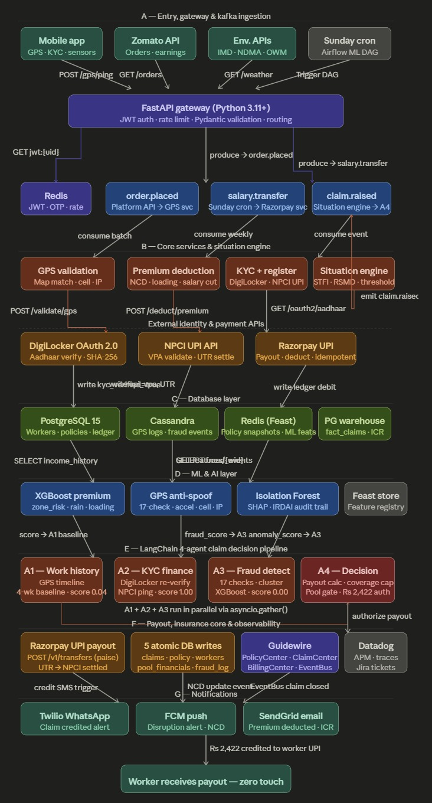
*Figure 3: GigEase complete system architecture — 8 layers from mobile app to notification delivery*

| Layer | Component | What Happens |
|:---:|---|---|
| **A — Entry** | Kafka + FastAPI + Mobile App | Mobile fires `POST /gps/ping` → FastAPI validates JWT via `GET jwt:{uid}` in Redis → produces to Kafka topics: `order.placed`, `salary.transfer`, `insurance.registered` |
| **B — Core Services** | GPS Validation + Situation Engine | Consumers trigger GPS validation (`POST /validate/gps`), premium deduction (`POST /premium/deduct`), KYC (`POST /kyc/verify`). When STFI/RSMD threshold crossed → emits to `claim.raised` Kafka topic |
| **C — External APIs** | DigiLocker + NPCI + Razorpay | DigiLocker OAuth 2.0 (`/oauth2/aadhaar`), NPCI UPI validate (`/npci/vpa/validate`), Razorpay transfer (`/v1/transfers`) — each writes result to DB layer |
| **D — Database** | PostgreSQL + Cassandra + Redis Feast | PostgreSQL (workers, policies, ledger), Cassandra (GPS/fraud events, real-time stream), Redis Feast (ML feature snapshots). Each feeds ML layer via SELECT or feature store GET calls |
| **E — ML & AI** | XGBoost + Isolation Forest + Prophet | XGBoost risk score flows into Agent 1. GPS anti-spoofing + Isolation Forest scores both feed into Agent 3 |
| **F — 4-Agent Pipeline** | LangChain + asyncio.gather() | A1 (work history, score 0.04) + A2 (KYC/finance, score 1.00) + A3 (fraud, score 0.00) run in parallel via `asyncio.gather()`. A4 sequentially receives all three scores, calculates ₹2,422 payout, fires `POST /v1/transfers` |
| **G — Payout** | Razorpay + Guidewire ClaimCenter | Executes transfer with `idempotency_key`. 5 atomic DB writes commit in one PG transaction. Guidewire ClaimCenter closes via `POST /claims/close`. Datadog traces full span. |
| **H — Notifications** | Twilio + FCM + SendGrid | WhatsApp (`POST /messages`), push (`POST /fcm/send`), email (`POST /mail/send`) all fire — worker receives credit alert with zero human intervention |

---

## 7. Registration Process

**4-step onboarding → auto policy creation → ML premium on signup**

```
Step 1: Personal Details    → name, phone, platform (Zomato/Swiggy), worker ID
Step 2: Location            → city, zone, pincode → zone risk badge shown live
Step 3: KYC (DigiLocker)    → Aadhaar SHA-256 hash verification (raw never stored)
Step 4: Payment Setup       → UPI ID validated via NPCI → NACH mandate signed
```

```bash
POST /api/registration/register
{
  "name": "Rajan K",
  "phone": "9876543210",
  "upi_id": "rajan.k@upi",
  "city": "Chennai",
  "zone": "velachery",
  "platform": "Zomato",
  "declared_weekly_income": 4500.0
}
```

**Response — full ML premium calculated instantly:**
```json
{
  "worker_id": "W-A8F3C2E1",
  "policy_id": "POL-B4D91F2A",
  "premium_breakdown": {
    "w_avg": 4500.0,
    "sum_insured": 6750.0,
    "zone_risk_score": 0.82,
    "seasonal_loading": 0.50,
    "total_premium": 133.45,
    "rider_premium": 93.42,
    "trigger_threshold": 2700.0
  }
}
```

---

## 8. Insurance Policy — STFI + RSMD

GigEase provides a **single combined policy** covering both risk categories under one weekly premium:

- **STFI** — Storm, Typhoon, Flood, Inundation *(natural disaster — β = 0.75)*
- **RSMD** — Riots, Strikes, Malicious Damage *(social disruption — β = 0.65)*

### STFI Triggers — Any ONE fires the event

| Parameter | Threshold | Source |
|---|:---:|---|
| Rainfall | > 80 mm / 24 hours | OpenWeatherMap + IMD |
| Wind Speed | > 50 km/h | OpenWeatherMap |
| Flood Alert Level | ≥ Level 2 (NDMA 0–4 scale) | NDMA Alert Feed |
| Cyclone Warning | Any active warning | IMD Cyclone Division |
| Visibility | < 50 metres | OpenWeatherMap |
| Heat Index | > 45°C heatwave declared | IMD + OpenWeatherMap |
| AQI | > 350 (Delhi zones) | AQICN / CPCB |

### RSMD Confirmation — 2 of 4 sources required

| Source | Trigger Condition |
|---|---|
| NewsAPI / GNews | Bandh/curfew/strike keywords, 3+ articles in 2-hour window |
| NDMA Alert Feed | `emergency_alert = TRUE` for city/district |
| Google Maps Traffic | `congestion_index > 0.85` (citywide gridlock) |
| Government/Police | Section 144, curfew order, or official strike notification |

### Policy Parameters

| Parameter | Value |
|---|---|
| Sum Insured | `clamp(1.5 × W_avg, ₹3,000, ₹15,000)` |
| ICR Target | 60–70% |
| Minimum Pool Reserve | 30% of total active sum insured |
| No Claim Discount | 2%/week, max 20%, resets after claim |
| Claim Loading | +5% (1 claim), +12% (2), +25% (3+) |
| Co-pay | 70% rider + 30% platform (Zomato CSR) |
| Minimum Payout | ₹200 |

---

## 9. Dynamic Premium — ML Engine

$$P_{\text{weekly}} = \frac{\lambda \times S}{4} \times (1 + r_{\text{adj}}) \times (1 - \text{NCD}) \times (1 + \text{loading})$$

$$r_{\text{adj}} = 0.50 \cdot \text{zone\_risk} + 0.30 \cdot \text{seasonal} + 0.20 \cdot \text{worker\_risk}$$

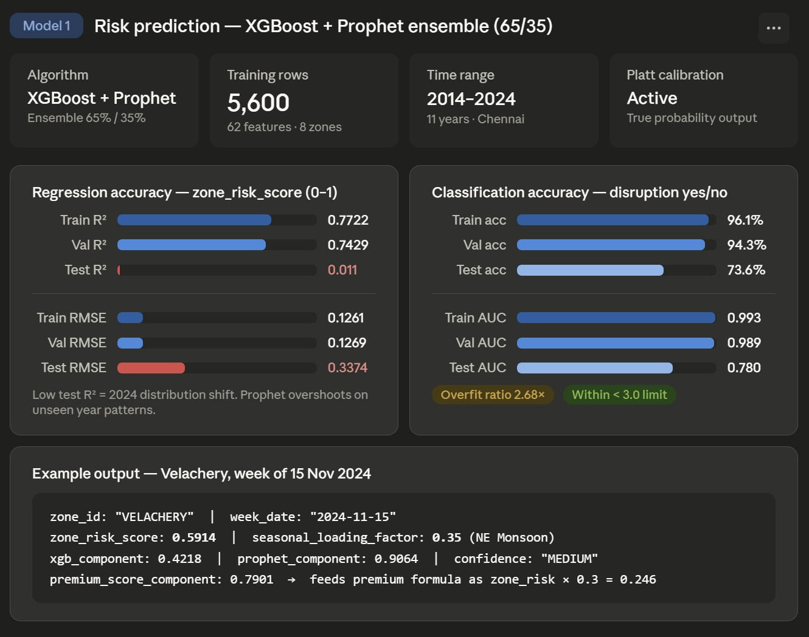
*Figure 4: XGBoost + Prophet ensemble risk prediction model*

### XGBoost 5-Feature Model

```
zone_risk_score      ████████████████ 38%  — flood history, drainage, elevation
rain_prob            ████████████ 27%       — 7-day OpenWeatherMap forecast
rider_history_score  ██████ 16%             — trips + claims + rating composite
ncd_factor           █████ 12%              — 1 − ncd_pct (higher NCD = lower risk)
loading_flag         ███  7%                — recent claim indicator
```

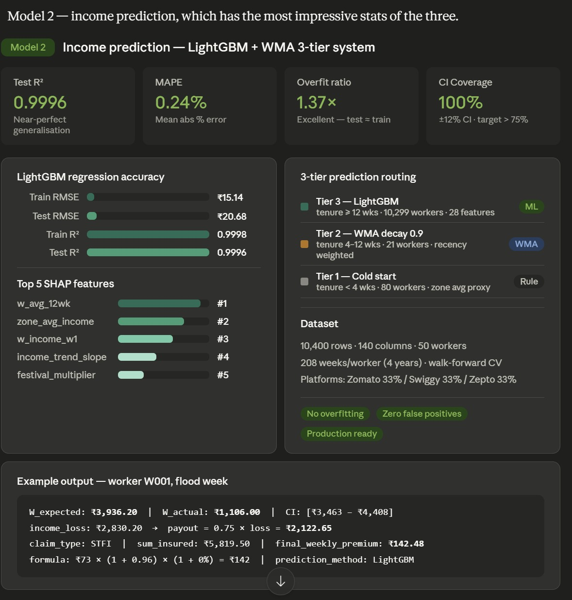
*Figure 5: Weighted Moving Average → LightGBM income prediction pipeline*

$$W_{\text{expected}} = \sum_{i=0}^{11} w_i \cdot \text{income}_{-i} \quad \text{where } w_i = \frac{0.9^i}{\sum_{j=0}^{11} 0.9^j}$$

**Ensemble formula:**

$$\text{risk\_score} = 0.65 \times \hat{y}_{\text{XGBoost}} + 0.35 \times \hat{y}_{\text{Prophet}}$$

**Zone Savings Tip:** If a rider in Velachery (risk 0.82) could operate in T Nagar (risk 0.30), they save ₹14.20/week. GigEase shows this tip proactively.

**Regulatory Guard (IRDAI non-negotiable):**
```python
floor   = W_avg * 1.5 * 0.035 / 4   # Actuarial minimum — pool solvency
ceiling = floor * 3.0                 # IRDAI maximum — 3× floor cap
premium = max(floor, min(ml_output, ceiling))
```

---

## 10. Claims Management — 13 Steps

**Zero worker action. Zero forms. Zero calls.**

```
Step  1 → Disruption confirmed (weather/NDMA/NewsAPI API threshold crossed)
Step  2 → All active policyholders in affected zone identified
Step  3 → Policy active status verified
Step  4 → W_actual fetched from platform API
Step  5 → Income trigger check: W_actual < 60% × W_avg?
Step  6 → Loss = W_avg − W_actual
Step  7 → Raw payout = β × loss (β=0.75 STFI, β=0.65 RSMD)
Step  8 → Fraud score computed — 17 checks, 4 weighted layers
Step  9 → Coverage cap applied: min(payout, sum_insured)
Step 10 → Pool reserve check: pool > 30% of total coverage
Step 11 → UPI transfer via Razorpay test mode
Step 12 → Push notification + WhatsApp sent
Step 13 → 5 DB tables updated atomically
```

**Traditional vs GigEase:**

| Traditional Insurance | GigEase |
|---|---|
| Worker files claim form | No form exists |
| Adjuster visits and investigates | 4 AI agents, no humans |
| 15–30 days to process | 10 minutes |
| Maybe gets paid | Definitely gets paid (if genuine) |
| Paper trail in an office | Blockchain-recorded forever |

---

## 11. Five Automated Triggers

```bash
# Trigger 1 — Live weather (OpenWeatherMap real API)
POST /api/triggers/check-weather/{city}
# Fires STFI if: rainfall > 80mm OR wind > 50km/h OR visibility < 50m

# Trigger 2 — Air quality (CPCB mock)
POST /api/triggers/check-aqi/{city}?mock_aqi=380
# AQI > 350 → STFI-equivalent for Delhi NCR

# Trigger 3 — Bandh / social disruption (mock)
POST /api/triggers/check-rsmd/{city}?mock_congestion=0.92
# Congestion > 0.85 + NewsAPI scan → RSMD confirmed

# Trigger 4 — Heatwave (IMD mock)
POST /api/triggers/check-heatwave/{city}?mock_temp_c=46.0
# Temperature > 45°C → heatwave trigger

# Trigger 5 — Flood alert (NDMA mock)
POST /api/triggers/check-flood/{city}?mock_flood_level=3
# Flood level ≥ 2 → STFI critical trigger

# Process all affected workers automatically
POST /api/triggers/process-claims/{event_id}
# Returns: workers_checked, claims_created, payout totals
```

---

## 12. Database Architecture

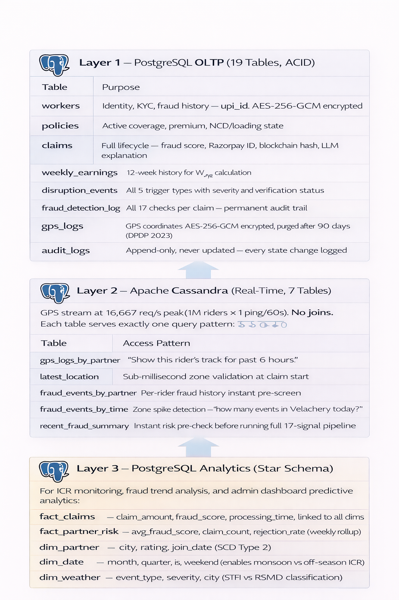
*Figure 6: Three-layer data strategy — OLTP + Real-time + Analytics*

### Layer 1 — PostgreSQL OLTP (19 Tables, ACID)

| Table | Purpose |
|---|---|
| `workers` | Identity, KYC, fraud history — `upi_id` AES-256-GCM encrypted |
| `policies` | Active coverage, premium, NCD/loading state |
| `claims` | Full lifecycle — fraud score, Razorpay ID, blockchain hash, LLM explanation |
| `weekly_earnings` | 12-week history for W_avg calculation |
| `disruption_events` | All 5 trigger types with severity and verification status |
| `fraud_detection_log` | All 17 checks per claim — permanent audit trail |
| `gps_logs` | GPS coordinates AES-256-GCM encrypted, purged after 90 days (DPDP 2023) |
| `audit_logs` | Append-only, never updated — every state change logged |

### Layer 2 — Apache Cassandra (Real-Time, 7 Tables)

GPS stream at **16,667 req/s peak** (1M riders × 1 ping/60s). No joins. Each table serves exactly one query pattern.

| Table | Access Pattern |
|---|---|
| `gps_logs_by_partner` | "Show this rider's track for past 6 hours" |
| `latest_location` | Sub-millisecond zone validation at claim start |
| `fraud_events_by_partner` | Per-rider fraud history instant pre-screen |
| `fraud_events_by_time` | Zone spike detection — "how many events in Velachery today?" |
| `recent_fraud_summary` | Instant risk pre-check before running full 17-signal pipeline |

### Layer 3 — PostgreSQL Analytics (Star Schema)

For ICR monitoring, fraud trend analysis, and admin dashboard predictive analytics:

```
fact_claims      — claim_amount, fraud_score, processing_time, linked to all dims
fact_partner_risk — avg_fraud_score, claim_count, rejection_rate (weekly rollup)
dim_partner      — city, rating, join_date (SCD Type 2)
dim_date         — month, quarter, is_weekend (enables monsoon vs off-season ICR)
dim_weather      — event_type, severity, city (STFI vs RSMD classification)
```

---

## 13. Security & Blockchain

| Component | Implementation |
|---|---|
| **TLS 1.3 + Cert Pinning** | ECDHE Perfect Forward Secrecy. SHA-256 of server cert hardcoded in app. MITM = immediate disconnect. |
| **AES-256-GCM** | PII encrypted before DB write: phone, UPI ID, GPS coordinates, IP address. Keys in AWS KMS. |
| **RS256 JWT** | RSA 2048-bit. Private key in HashiCorp Vault. 24h expiry. 64-byte refresh tokens in Redis. |
| **HMAC-SHA256** | Per-device request signing. Timestamps >90 seconds rejected (replay attack prevention). |
| **DPDP Act 2023** | GPS purged after 90 days. Aadhaar: SHA-256 hash only, raw never stored. |
| **Polygon Blockchain** | Every payout permanently recorded. `GigShieldLedger` Solidity contract. Rider verifies on Polygonscan. |

**Why Polygon over Ethereum:**

| | Ethereum | Polygon |
|:---:|:---:|:---:|
| Gas per transaction | ₹1,500–₹3,000 | **₹0.01** |
| 10,000 payouts/month | ₹1.5–3 crore | **₹100** |
| Transactions/second | ~15 | 65,000 |

---

## 14. IRDAI & Regulatory Compliance


| IRDAI Requirement | GigEase Solution |
|---|---|
| **Pricing** auto-adjusts by season/area | XGBoost ML model with seasonal loading. Velachery November = +50%. T Nagar March = 0%. |
| **Accuracy** — match worker location with weather | GPS + cell tower + NDMA zone overlap. Worker's registered zone must match confirmed disruption zone. |
| **Fraud Prevention** — stop GPS faking | Physics-based L1 layer: accelerometer + cell tower = unfakeable without hardware. |
| **Financial Proof** — quantify historical frequency | Velachery floods 8 of last 10 Oct–Jan seasons. Pool stress-tested at 14-day monsoon. ICR target 60–70%. |


**All 10 insurance checklist items — answered:**

| # | Question | Answer |
|:---:|---|---|
| 1 | Trigger objective and verifiable? | ✅ OpenWeatherMap + NDMA. Rainfall >80mm. AQI >300 from CPCB. All publicly auditable. |
| 2 | Excluded health, life, vehicle? | ✅ Income loss from STFI/RSMD only. Explicitly stated in policy XYZ v1.0. |
| 3 | Payout automatic? | ✅ Trigger → GPS verified → UPI within 10 minutes. Zero rider action. |
| 4 | Pool financially sustainable? | ✅ ICR target 60–70%. 30% min reserve. Seasonal loading pre-builds buffer. |
| 5 | Fraud on data, not behaviour? | ✅ L1 hardware physics. Cell tower + accelerometer. Isolation Forest. DBSCAN. |
| 6 | Premium collection frictionless? | ✅ Auto-deducted from platform earnings every Monday via NACH mandate. |
| 7 | Pricing dynamic, not flat? | ✅ XGBoost + Prophet. Zone × season × worker history. Personalised per rider. |
| 8 | Blocked adverse selection? | ✅ Enrollment locked 48 hours before active weather red alert. |
| 9 | Operational cost near zero? | ✅ Fully automated 13-step pipeline. Zero adjusters. Blockchain at ₹0.01/tx. |
| 10 | Basis risk minimized? | ✅ Hyper-local zone triggers. Worker GPS must be in confirmed disruption zone. |


**DPDP Act 2023 — Three Data Types We Collect:**

| Data Type | Purpose | Consent Mechanism |
|---|---|---|
| GPS location | Verify worker in trigger zone | Separate consent screen at onboarding |
| Bank / UPI account | Payout disbursement | Explicit consent + KYC |
| Platform activity data | Confirm active delivery days | Data sharing agreement with platform |

---

## 15. Quick Start — Run Locally

### Prerequisites

```
Python 3.11+    Node.js 18+    Git
```

### Backend

```bash
git clone https://github.com/Abijith-U0245/GigEase_AI_Insurance_Platform
cd GigEase_AI_Insurance_Platform/GIGEASE-GUIDEWIRE-PROTOTYPE/backend

python -m venv venv
source venv/bin/activate          # Windows: venv\Scripts\activate
pip install -r requirements.txt

cp .env.example .env
# Edit .env — add your API keys (see below)

uvicorn main:app --reload --port 8000
```

✅ Open **http://localhost:8000/docs** — Swagger UI with all 200+ endpoints

### Frontend

```bash
cd ../frontend
npm install
npm run dev
```

✅ Open **http://localhost:5173**

### Environment Variables

```env
# Required — all free tier
OPENWEATHERMAP_API_KEY=your_key   # openweathermap.org/api (1,000 calls/day free)
RAZORPAY_KEY_ID=rzp_test_xxxxxx  # Razorpay test mode (no real money)
RAZORPAY_KEY_SECRET=your_secret
DATABASE_URL=sqlite:///./gigease.db
SECRET_KEY=gigease_secret_2026

# Optional — for full ML pipeline
NEWSAPI_KEY=your_key              # newsapi.org free tier
```

### Judge Demo — 5 Steps, 5 Minutes

```bash
# 1. Register a rider
curl -X POST http://localhost:8000/api/registration/register \
  -H "Content-Type: application/json" \
  -d '{"name":"Rajan K","phone":"9876543210","upi_id":"rajan.k@upi",
       "city":"Chennai","zone":"velachery","platform":"Zomato",
       "declared_weekly_income":4500,"password":"test123","email":"rajan@test.com"}'
# → See worker_id, policy_id, full 8-step ML premium breakdown

# 2. View policy
curl http://localhost:8000/api/policy/{worker_id}
# → Policy active, STFI+RSMD coverage, zone risk 0.82

# 3. See ML premium breakdown
curl http://localhost:8000/api/premium/breakdown/{worker_id}
# → XGBoost 5 features, zone tip: "T Nagar saves ₹14.20/week"

# 4. Fire a flood trigger
curl -X POST "http://localhost:8000/api/triggers/check-flood/chennai?mock_flood_level=3"
# → Returns event_id: EVT-STFI-XXXXXX

# 5. Process all claims automatically
curl -X POST http://localhost:8000/api/triggers/process-claims/{event_id}
# → claims_created, fraud scores, Razorpay UTRs — all in under 10 minutes

# Alternatively — open Swagger UI
# http://localhost:8000/docs
```

---

## 16. API Reference

### Registration & Auth

| Method | Endpoint | Description |
|---|---|---|
| `POST` | `/api/registration/register` | Register rider → auto-creates policy with ML premium |
| `POST` | `/api/auth/send-otp` | Send OTP to phone |
| `POST` | `/api/auth/verify-otp` | Verify OTP → JWT token |
| `POST` | `/api/kyc/digilocker` | DigiLocker KYC redirect |

### Policy & Premium

| Method | Endpoint | Description |
|---|---|---|
| `GET` | `/api/policy/{worker_id}` | Full policy details |
| `GET` | `/api/policy/{id}/events` | Immutable audit log |
| `GET` | `/api/policy/{id}/ncd` | NCD progress tracker |
| `GET` | `/api/premium/breakdown/{worker_id}` | Full ML breakdown + 8 steps |
| `GET` | `/api/premium/zone-tips/{worker_id}` | Zone savings suggestions |
| `GET` | `/api/premium/model-info/{worker_id}` | XGBoost feature importances |

### Triggers & Claims

| Method | Endpoint | Description |
|---|---|---|
| `POST` | `/api/triggers/check-weather/{city}` | Live OpenWeatherMap STFI check |
| `POST` | `/api/triggers/check-aqi/{city}` | AQI pollution trigger |
| `POST` | `/api/triggers/check-rsmd/{city}` | Bandh/RSMD dual-source |
| `POST` | `/api/triggers/check-heatwave/{city}` | Heatwave trigger |
| `POST` | `/api/triggers/check-flood/{city}` | NDMA flood alert |
| `POST` | `/api/triggers/process-claims/{event_id}` | **Auto-process all claims** |
| `GET` | `/api/claims/{worker_id}` | Claims history |
| `GET` | `/api/claims/{claim_id}/status` | 13-step pipeline status |
| `POST` | `/api/claims/{claim_id}/appeal` | Submit appeal |

### Admin Dashboard

| Method | Endpoint | Description |
|---|---|---|
| `GET` | `/api/admin/overview` | Pool balance, ICR, active policies |
| `GET` | `/api/admin/icr` | ICR monitor + auto-adjustment history |
| `GET` | `/api/admin/claims` | Full claims + fraud audit log |
| `POST` | `/api/trigger/simulate` | Trigger simulator for demo |
| `GET` | `/api/admin/model-info` | XGBoost metrics + Airflow DAG status |

---

## 17. Tech Stack

```
FastAPI, Python, SQLAlchemy, SQLite, PostgreSQL, TimescaleDB, Apache Kafka, Redis,
React, TailwindCSS, XGBoost, LightGBM, scikit-learn, Facebook Prophet, SHAP,
Isolation Forest, DBSCAN, NumPy, Pandas, Razorpay, Polygon, Solidity, Web3.py,
Hardhat, OpenWeatherMap API, NDMA Alert Feed, AQICN, Google Maps Platform,
NewsAPI, DigiLocker API, NPCI UPI API, LangChain, OpenAI API, Ollama, Llama 3,
HashiCorp Vault, AWS KMS, Cloudflare, Kong, Railway, Vercel, Docker, Celery,
joblib, Twilio, FCM, SendGrid, Apache Spark, PgBouncer, Datadog
```

### Dependencies

```txt
fastapi==0.110.0
uvicorn==0.29.0
sqlalchemy==2.0.29
python-dotenv==1.0.1
httpx==0.27.0
razorpay==1.3.0
numpy==1.26.4
scikit-learn==1.4.2
pydantic[email]==2.7.0
python-jose==3.3.0
passlib==1.7.4
bcrypt==4.1.2
apscheduler==3.10.4
```

---

## 18. Key Numbers

<div align="center">

| | | | |
|:---:|:---:|:---:|:---:|
| **15M** | **₹0** | **10 min** | **145%** |
| gig workers in India | current protection | flood to UPI credit | income stability improvement |
| **₹421** | **₹4,420** | **2,000×** | **₹0.01** |
| premiums paid (5 weeks) | payouts received | faster than traditional | per blockchain tx |
| **17** | **4** | **36** | **355** |
| fraud checks/claim | AI agents/claim | UI screens built | UI components documented |

</div>

### 5-Week Simulation Proof

| Week | Event | W_actual | Payout | Net Income |
|:---:|---|:---:|:---:|:---:|
| W1 | Normal | ₹4,305 | ₹0 | ₹4,221 |
| W2 | Light rain | ₹3,700 | ₹0 | ₹3,618 |
| **W3** | **Cyclone Dana** | ₹1,106 | **₹2,681** | **₹3,708** |
| W4 | Recovery | ₹3,253 | ₹0 | ₹3,167 |
| **W5** | **Chennai Bandh** | ₹1,824 | **₹1,739** | **₹3,473** |

> **₹421 in premiums protected ₹4,420 in payouts — 145% income stability in disruption weeks.**
> Without GigEase, weeks 3+5 combined = ₹2,930. With GigEase = ₹7,181.

---

## 19. Project Links

| Resource | Link |
|---|---|
| 🏠 **GitHub Repository** | [GigEase_AI_Insurance_Platform](https://github.com/Abijith-U0245/GigEase_AI_Insurance_Platform/tree/master/GIGEASE-GUIDEWIRE-PROTOTYPE) |
| 📁 **All Documents & Assets** | [Google Drive](https://drive.google.com/drive/folders/1F5CfYnu5FC5AP3F7LvtGqSQmAd2889XE) |
| 🎬 **Phase 2 Demo Video** | [YouTube](https://youtu.be/W9BuAyNVfU8?si=SQ-h_7hhknkECGSw) |
| 🎬 **Phase 3 Demo Video (5 min)** | `[ADD LINK BEFORE APRIL 17]` |
| 📊 **Final Pitch Deck (PDF)** | [Pitch Deck](https://drive.google.com/file/d/14ix5F6Q2dUPkAYkqDYGih2rvi_ccVFl-/view?usp=drivesdk) |

---

<div align="center">

---

**GigEase — Protecting Every Delivery, Every Day**

*India's First Parametric Income Protection for Gig Workers*

`#DevTrails2026` · `Guidewire Hackathon` · `Phase 3 Final` · `April 17, 2026`

**4 Agents · 17 Checks · 8 Architecture Layers · 10 Minutes · 0 Human Decisions**

---

*Abijith U · Tarun Aadarsh B · Priyadharshini · Monish M*
*Chennai Institute of Technology ·*

</div>
