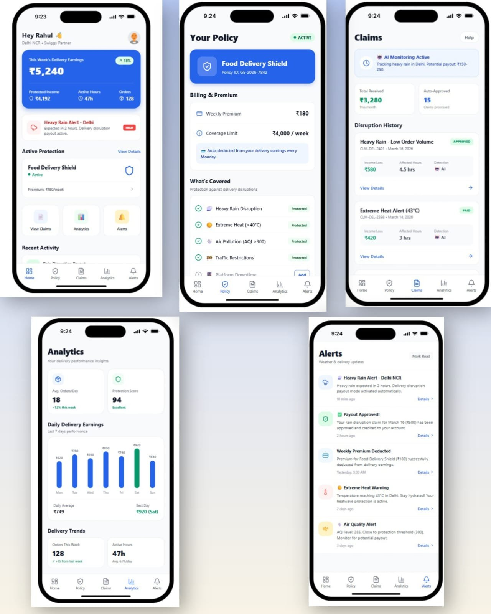
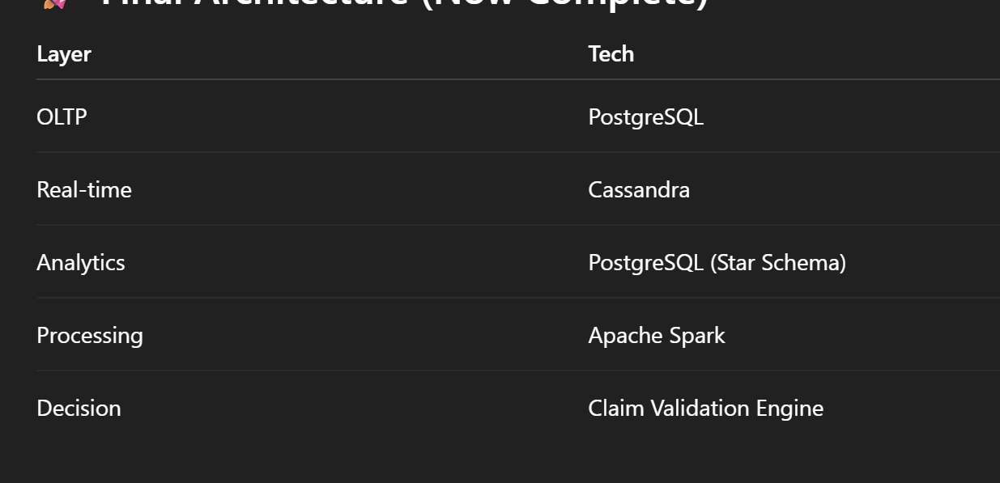
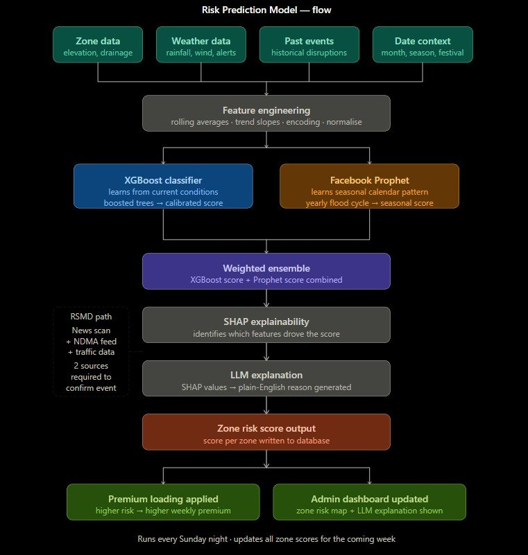
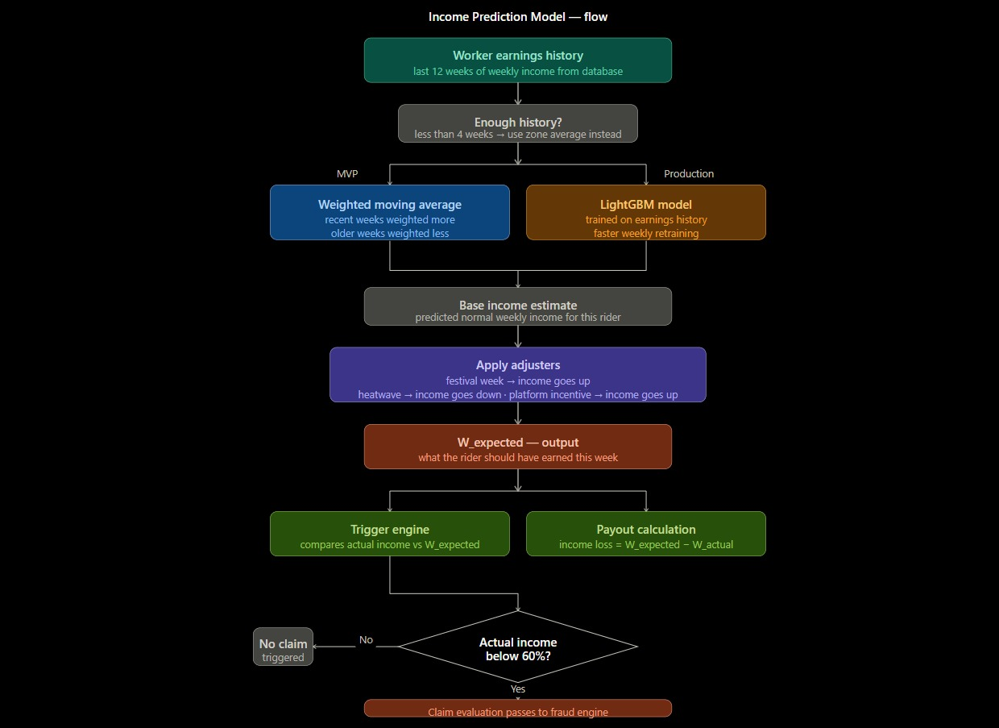
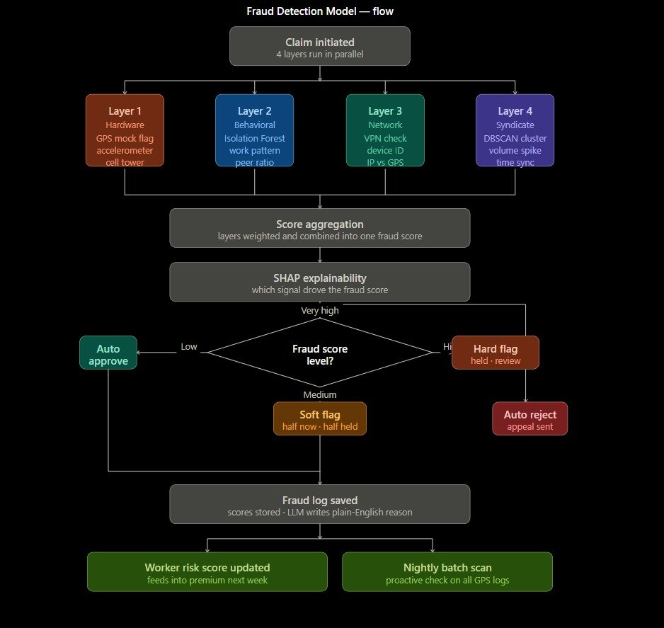

# GigEase — AI-Powered Parametric Income Protection for Gig Workers

> *"When a flood hits Velachery and every enrolled rider receives money in their account before the roads even clear — that is not a demo. That is what this technology was built for."*

**India's First Parametric Insurance Platform for Food Delivery Partners**

| Platform | Coverage | Payout Speed | Premium Range |
|---|---|---|---|
| Zomato / Swiggy / Zepto | STFI + RSMD Combined | Under 10 minutes | From ₹25/week |

**Team:** Abijith U · Tarun Aadarsh B · Priyadharshini · Monish M
**Event:** DevTrails 2026 — Guidewire Hackathon · #DevTrails2026

---

## Table of Contents

1. [Problem Statement](#1-problem-statement)
2. [Mobile App — UI Design](#2-mobile-app--ui-design)
3. [Insurance Policy Design](#3-insurance-policy-design)
4. [GPS Anti-Spoofing Architecture](#4-gps-anti-spoofing-architecture)
5. [Adversarial Defense — Market Crash Response](#5-adversarial-defense--market-crash-response)
6. [End-to-End STFI Use Case — Cyclone Dana](#6-end-to-end-stfi-use-case--cyclone-dana)
7. [Database Architecture — Three-Layer Strategy](#7-database-architecture--three-layer-strategy)
8. [Machine Learning System — Three Models](#8-machine-learning-system--three-models)
9. [Complete System Architecture](#9-complete-system-architecture)
10. [Financial Model](#10-financial-model)
11. [Security Architecture & Blockchain](#11-security-architecture--blockchain)
12. [Complete Technology Stack](#12-complete-technology-stack)
13. [Impact, Future Scope & Team](#13-impact-future-scope--team)

---

## 1. Problem Statement

India has over **15 million gig economy delivery workers** across Zomato, Swiggy, Zepto, Amazon, and Dunzo. These workers have no fixed salary, no paid leave, no employer-provided insurance, and no income guarantee. Every rupee they earn depends entirely on being able to ride their vehicle to a customer's location and deliver an order.

A Zomato delivery partner in Chennai earns through per-order distance pay (₹4.5/km), waiting time pay (₹1/min after 3 free minutes), a ₹15 minimum floor per order, daily target bonuses (₹160–₹410), and weekly performance bonuses (₹325–₹575). A full-time rider working 6 days per week under normal conditions earns ₹4,000–₹6,000 per week.

**During a cyclone or severe flood, that same rider earns ₹0.** They still owe rent, EMI on their bike loan, school fees, and daily household expenses. There is no buffer. There is no safety net. There is no insurance.

### 1.1 Why This Happens Constantly

Chennai floods every October–January due to the northeast monsoon. Cyclones hit the Tamil Nadu coast multiple times annually. Delhi experiences dangerous heatwaves from May–July where riding outdoors becomes physically impossible. Political bandhs, state-level strikes, curfews, and civic disruptions cause sudden complete shutdowns of delivery operations with zero warning.

### 1.2 Why Traditional Insurance Fails Gig Workers

| Problem | Traditional Insurance | GigEase Solution |
|---|---|---|
| Claims process | 3–8 weeks, manual adjuster | Automatic in under 10 minutes |
| Income documentation | Pay slips, Form 16 required | Uses verified platform earnings history |
| Affordability | High premium, unverifiable income | ₹25–₹250/week, auto-deducted from earnings |
| Speed of payment | Weeks after loss | Minutes after trigger fires |
| Claim filing | Complex forms, branch visits | Zero paperwork — fully parametric |
| Trust in payout | Approval can be reversed | Blockchain-recorded, immutable |

No insurance company in India currently offers parametric income protection designed specifically for gig workers. IRDAI does not yet have a defined product category for this. GigEase is designed to be the first.

---

## 2. Mobile App — UI Design

The GigEase mobile app is the rider's primary touchpoint. The design philosophy is radical simplicity: the rider never files a claim, never calls a number, never uploads a document. The app shows earnings, protection status, and payout history. Everything else happens automatically in the background.


*Figure 1: GigEase Mobile App — Home Dashboard, Policy, Claims, Analytics, and Alerts screens*

### 2.1 Screen-by-Screen Breakdown

**Home Dashboard**
This week's earnings (₹5,240 shown, +18% week-on-week), Protected Income / Active Hours / Orders metrics at a glance. Heavy Rain Alert banner in red with HIGH priority badge. Active Protection card showing Food Delivery Shield at ₹180/week. Quick access to View Claims, Analytics, Alerts. Recent Activity feed below.

**Policy Screen**
Policy ID (GE-2026-7842), ACTIVE status badge. Weekly Premium ₹180, Coverage Limit ₹4,000/week. Auto-deduction notice (from delivery earnings every Monday). What's Covered: Heavy Rain Disruption, Extreme Heat (>40°C), Air Pollution (AQI >300), Traffic Restrictions — all marked Protected. Platform Downtime shown with Add option for future expansion.

**Claims Screen**
AI Monitoring Active banner with real-time tracking. Total Received ₹3,280 this month, 15 Auto-Approved claims processed. Disruption History: CLM-DEL-2401 (Heavy Rain — Low Order Volume, ₹580 income loss, 4.5 hours affected, AI-detected) marked APPROVED; CLM-DEL-2398 (Extreme Heat Alert 43°C, ₹420, 3 hours, AI-detected) marked PAID.

**Analytics Screen**
Avg Orders/Day: 18 (+12% this week). Protection Score: 94/100 (Excellent). Daily Delivery Earnings bar chart for last 7 days. Daily Average ₹749, Best Day ₹920 (Saturday, highlighted green). Delivery Trends: 128 orders this week (+15 from last), 47 active hours (6.7h/day average).

**Alerts Screen**
Heavy Rain Alert — Delhi NCR: rain expected in 2 hours, disruption payout mode activated automatically. Payout Approved: ₹580 for March 16 rain claim credited. Weekly Premium Deducted: ₹180 at 9 AM yesterday. Extreme Heat Warning: 43°C in Delhi, heatwave protection active. Air Quality Alert: AQI 285, approaching threshold 300. Each with timestamp and Details deep-link.

### 2.2 Core UX Principles

- **Zero manual claim filing** — parametric trigger detects events automatically, no rider action required
- **Push notifications + WhatsApp** — rider is informed proactively, never needs to check in
- **Protection Score (0–100)** — gamifies safe riding behavior and builds trust in the system
- **Plain-English LLM explanations** — every decision (approval or rejection) has a human-readable reason
- **Policy ID + blockchain hash** — rider can independently verify their payout on Polygonscan without trusting GigEase

---

## 3. Insurance Policy Design

GigEase provides a **single combined policy** covering both STFI (Storm, Typhoon, Flood, Inundation) and RSMD (Riots, Strikes, Malicious Damage) under one weekly premium. One enrolment. One policy. Two risk categories covered simultaneously. No separate policy per category required.

### 3.1 Core Policy Parameters

| Parameter | Value / Formula |
|---|---|
| Policy Type | Combined STFI + RSMD Parametric Income Protection |
| W_avg (base income) | Rolling 12-week weighted average (decay=0.9) of verified platform earnings |
| Sum Insured | `clamp(1.5 × W_avg, ₹3,000, ₹15,000)` |
| Trigger Threshold | `W_actual < 60% of W_expected` AND confirmed qualifying event in rider's zone |
| Payout Beta — STFI | **β = 0.75** — 75% of income loss covered |
| Payout Beta — RSMD | **β = 0.65** — 65% of income loss covered |
| Base Lambda — STFI | 3.5% of sum insured annually (seasonal, zone-predictable) |
| Base Lambda — RSMD | 1.5% of sum insured annually (unpredictable, low frequency) |
| Payout Speed | Direct UPI credit within 10 minutes of trigger confirmation |
| Minimum Payout | ₹200 — claims below this threshold are not processed |
| Minimum Pool Reserve | 30% of total active sum insured must remain in pool before any payout executes |
| ICR Target | 60–70%: for every ₹100 collected, ₹60–70 paid out |
| No Claim Discount | 2% per consecutive clean week, capped at 20% (resets after any paid claim) |
| Claim Loading | +5% after 1 claim, +12% after 2, +25% after 3+ claims in any 4-week window |
| Co-pay Split | 70% rider (`clamp ₹25–₹250/week`) + 30% Zomato platform CSR contribution |

### 3.2 STFI Parametric Triggers

Event fires if **ANY** of these thresholds are crossed in the rider's primary zone:

| Parameter | Threshold | Data Source | Notes |
|---|---|---|---|
| Rainfall | > 80 mm in 24 hours | OpenWeatherMap + IMD | Primary trigger signal |
| Wind Speed | > 50 km/h sustained | OpenWeatherMap | Cyclone indicator |
| Flood Alert Level | >= Level 2 (NDMA scale 0–4) | NDMA Alert Feed | 1 source sufficient for STFI |
| Cyclone Warning | Any active warning issued | IMD Cyclone Division | Immediate trigger on issuance |
| Visibility | < 50 metres | OpenWeatherMap | Storm / severe fog |
| Heat Index | > 45°C heatwave declared | IMD + OpenWeatherMap | Delhi May–Jul season |
| AQI | > 350 (Delhi zones) | AQICN / CPCB | Pollution disruption equivalent |

### 3.3 RSMD Dual-Source Confirmation

RSMD requires confirmation from **at least 2 of 4 independent sources**:

| Source | Trigger Condition |
|---|---|
| NewsAPI / GNews | Bandh / curfew / strike keywords + city match, 3+ articles from different outlets in 2-hour window |
| NDMA Alert Feed | `emergency_alert = TRUE` for the city/district |
| Google Maps Traffic | City-wide `congestion_index > 0.85` — gridlock indicative of shutdown |
| Government / Police Advisory | Section 144, curfew order, or official strike notification issued |

### 3.4 Payout Formula — Step by Step

$$\text{Loss} = W_{\text{expected}} - W_{\text{actual}}$$

$$\text{Raw Payout} = \beta \times \text{Loss}$$

$$\text{Final Payout} = \min(\text{Raw Payout} - \text{Fraud Deduction},\ \text{Sum Insured})$$

| Step | Formula / Logic |
|---|---|
| 1. Trigger check | REJECT if `W_actual >= 0.60 × W_expected` |
| 2. Income loss | `loss = W_expected - W_actual` |
| 3. Raw payout | `raw_payout = β × loss` (β=0.75 STFI, β=0.65 RSMD) |
| 4. Fraud deduction | `payout_after_fraud = raw_payout - fraud_deduction` |
| 5. Coverage cap | `final_payout = min(payout_after_fraud, sum_insured)` |
| 6. Minimum check | REJECT if `final_payout < ₹200` |
| 7. Pool liquidity | EXECUTE if `pool_balance - final_payout > 0.30 × total_active_sum_insured`; else QUEUE |
| 8. UPI transfer | Razorpay Payout API → NPCI → rider bank account (2–3 min transit) |

### 3.5 Worked Example — Rajan K, Cyclone Dana, Velachery

| Parameter | Calculation | Value | Status |
|---|---|---|---|
| W_avg (12-week rolling) | ₹54,000 ÷ 12 | ₹4,500/week | — |
| W_actual (flood week) | Mon ₹497 + Tue ₹475 + Wed–Fri ₹0 + Sat ₹67 | ₹1,039 | — |
| Trigger threshold (60%) | 0.60 × ₹4,500 | ₹2,700 | ₹1,039 < ₹2,700 → **TRIGGERED** |
| Income loss | ₹4,500 − ₹1,039 | ₹3,461 | — |
| Raw payout (β = 0.75) | 0.75 × ₹3,461 | ₹2,595.75 | — |
| Fraud deduction | Score 0.00 — all 17 checks clean | ₹0 | AUTO-APPROVE |
| Coverage cap | ₹2,595 < ₹6,750 | No cap needed | Pass |
| Pool reserve | ₹42,85,077 > ₹20,25,000 minimum | Execute | Pass |
| **FINAL PAYOUT** | Credited to rajan.k@upi in 10 minutes | **₹2,595.75** | **PAID** |

### 3.6 Five-Week Simulation — Income Stability Proof

| Week | Event | W_actual vs W_expected | Payout | Net Income |
|---|---|---|---|---|
| Week 1 — Normal | No disruption | ₹4,305 vs ₹4,500 — not triggered | ₹0 | ₹4,221 (after ₹84 premium) |
| Week 2 — Slow | Light rain only | ₹3,700 vs ₹4,500 — not triggered | ₹0 | ₹3,618 (after ₹82, NCD 4%) |
| **Week 3 — STFI Flood** | **Cyclone Dana** | ₹1,106 vs ₹4,680 — **TRIGGERED** | **₹2,681** | **₹3,708** |
| Week 4 — Recovery | Post-flood slow | ₹3,253 vs ₹4,500 — not triggered | ₹0 | ₹3,167 (after ₹86, loading +5%) |
| **Week 5 — RSMD** | **Chennai Bandh** | ₹1,824 vs ₹4,500 — **TRIGGERED** | **₹1,739** | **₹3,473** |

> **Result:** Total premiums paid ₹421 · Total payouts ₹4,420 · **145% income stability improvement during disruption weeks.** Without GigEase, weeks 3+5 combined = ₹2,930. With GigEase = ₹7,181.

---

## 4. GPS Anti-Spoofing Architecture

GPS spoofing is the primary fraud vector in any location-based parametric insurance system. A fraudster uses a fake GPS application to place their device coordinates in a flood zone while physically sitting in a different area entirely. Without robust anti-spoofing defenses, a coordinated fraud ring could drain the entire liquidity pool in hours.

GigEase uses a **multi-layer architecture** combining physical hardware signals, network triangulation, sensor fusion, movement physics, and behavioral analysis. No single layer is sufficient alone. The power comes from requiring all evidence to converge before approving a claim.

### 4.1 The Core Anti-Spoofing Insight — Physics Cannot Be Faked at Software Layer

A GPS spoofing app operates entirely at the Android OS software layer. It replaces the GPS coordinates returned by the location API. However, it fundamentally **cannot**:

- Change which cell tower the phone is physically connected to — radio signal physics determines tower connection, not software
- Alter the accelerometer readings — inertial sensor measures gravity (always ~9.81 m/s² on a stationary object) regardless of GPS coordinates
- Fake IP geolocation — network infrastructure determines IP geographic location
- Produce naturally degraded GPS accuracy that real monsoon rain causes (heavy cloud cover genuinely attenuates satellite signals)
- Coordinate 500 different spoofing apps to produce varied, naturally-distributed, non-synchronized behavior patterns

**The key formula:**

$$\text{Accel Magnitude} = \sqrt{x^2 + y^2 + z^2}$$

A stationary phone reads **~9.81 m/s²** (gravity only). A phone on a moving delivery bike reads higher due to road vibration and acceleration. If GPS coordinates report movement at 30 km/h but the accelerometer shows a constant 9.81 m/s² — **the GPS is being spoofed**. Physically unfakeable without hardware modification.

### 4.2 Module-by-Module Architecture

| Module | Data Captured / Key Checks |
|---|---|
| **Mobile App — Data Collection** | GPS: lat/lng/accuracy/speed. Accelerometer (TYPE_ACCELEROMETER x/y/z). Gyroscope. Device flags: `is_mocked_location`, developer mode, Google Play Integrity API. Cell tower: LAC + Cell ID via TelephonyManager. IP address from HTTP headers. Every 60 seconds. |
| **Real-Time Data Ingestion** | Apache Kafka accepts GPS stream (1M riders = 16,667 req/s peak). Partitioned by `worker_id`. Consumer batch 1,000 records. Timestamps attached, units normalised. Real-time mock_location rule check on consumer side — immediate detection before DB write. |
| **Location Validation Layer** | GPS accuracy check: ±5m during cyclone = suspicious (too perfect). Map matching to road network (Google Maps Roads API + OSM). Path continuity check. Teleport detection: >5km in <3 minutes = impossible on city delivery bike. |
| **Sensor Fusion Engine** | GPS velocity > 0 + accelerometer magnitude = 9.81 m/s² → GPS spoofing. Static detection: phone physically stationary on flood days = consistent with genuine stranded rider. Movement consistency: natural bike movement has characteristic vibration signature. |
| **Network Validation Layer** | Cell tower triangulation via TelephonyManager. Tower location (Google Geolocation API / OpenCellID) must match GPS zone. IP geolocation (MaxMind GeoIP) cross-checked against GPS. VPN/proxy detection via ASN lookup. |
| **Movement & Physics Engine** | Speed limit: bike cannot exceed 120 km/h between 60-second pings. Zone transition feasibility via road network graph. Route smoothness: genuine GPS has natural jitter; fake GPS from spoofing apps often produces suspiciously perfect straight-line paths. |
| **Behavior & Cluster Analyzer** | Isolation Forest on 11 behavioral features. DBSCAN clusters home GPS coordinates — genuine city-wide event: claims distributed across many zones; fraud ring: tight geographic home cluster within 500m. |
| **Fraud Scoring Service** | `final = 0.40×L1 + 0.30×L2 + 0.15×L3 + 0.15×L4`. Override: if L1>0.85 OR L2>0.90 → `max(final, 0.75)`. SHAP top feature identified. LLM plain-English reason generated. |
| **Claim Decision Engine** | <0.30 → AUTO APPROVE. 0.30–0.50 → SOFT FLAG (50% now + 50% held). 0.50–0.70 → HARD FLAG (full hold). >0.70 → AUTO REJECT. |
| **Payout & Review System** | Razorpay UPI transfer. Polygon blockchain record. WhatsApp + push notification. Human reviewers can override any AI decision with documented reasoning. |

---

## 5. Adversarial Defense — Market Crash Response

> 🚨 **Phase 1 — Market Crash:** 500 delivery partners. Fake GPS. Real payouts. A coordinated fraud ring just drained a platform's liquidity pool and yours is next. How do you spot the faker from the genuinely stranded worker? What data catches a fraud ring? How do you flag bad actors without punishing honest ones?

### 5.1 The Differentiation — Genuine Stranded Worker vs GPS Spoofer

The core problem: both a genuine flood victim and a GPS spoofer can produce GPS coordinates showing them in a flooded zone. The differentiation lies entirely in **every other signal converging or diverging**.

#### 5.1.1 The Physics Test — Layer 1 (Weight 0.40, Highest Priority)

**Genuine rider (Rajan K, Velachery):** Phone is physically stationary at home inside the flood zone. Accelerometer = 9.81 m/s² constant. GPS shows actual home address in Velachery. Cell tower C-VLY-04 confirms Velachery. GPS accuracy degrades to ±120m — exactly what heavy rain does to satellite signal reception. Every signal agrees.

**Fraudster (Suresh M, T Nagar):** Spoofing app places GPS in Velachery. Accelerometer still reads 9.81 m/s² — because he's physically stationary at home in T Nagar. GPS claims movement through flood routes. Cell tower T-NGR-07 is physically in T Nagar, **6.2km from claimed GPS location**. GPS accuracy is suspiciously perfect — ±5m in a cyclone, because the app generates clean synthetic coordinates. Every layer contradicts every other.

| Signal | Genuine Rajan (Velachery) | Fraudster Suresh (T Nagar) | Score Added |
|---|---|---|---|
| `is_mocked_location` flag | FALSE on all 20 pings | TRUE on 14/20 pings (fake GPS app detected) | **+0.60** |
| Accelerometer vs GPS mismatch | GPS also stationary — consistent | GPS shows movement, accel = 9.81 m/s² static | **+0.55** |
| Cell tower vs GPS location | C-VLY-04 = Velachery — matches GPS | T-NGR-07 = T Nagar, 6.2km from claimed GPS | **+0.35** |
| GPS accuracy during cyclone | ±120m — degraded by rain (physically expected) | ±5m — suspiciously perfect (synthetically generated) | **+0.25** |
| Zone-weather cross-check | Velachery GPS + NDMA confirms Velachery flooded | Cell tower = T Nagar (dry per weather API) despite GPS claiming Velachery | **+0.80** |
| Pre-event order acceptance | 100% Mon–Tue — normal work behavior | Refused 11 orders Mon–Tue — deliberate income suppression | **+0.30** |
| 4-week work history | 91–94% acceptance rate consistently | Dropped to 40% vs 91% historical average | **+0.25** |
| **Final fraud score** | 0.08 − 0.05 (zone peers) − 0.04 (GPS degradation) = **0.00** | 3.05 total, capped at **1.00** | **APPROVE vs REJECT** |

#### 5.1.2 Why Cell Tower Is the Unbreakable Signal

A GPS spoofing app operates at the Android application layer — it replaces what the GPS location API returns to apps. Cell tower connection is a **hardware radio function**. The phone's baseband processor (physically separate from the application processor) connects to whichever physical tower has the strongest radio signal. No Android application — including root-level spoofing apps — can override which physical tower the baseband hardware connects to without being physically near that tower.

This is why even a sophisticated spoofing app that defeats the `is_mocked_location` flag still fails: **tower T-NGR-07 physically cannot be in Velachery**. Cell tower identity is ground truth.

---

### 5.2 The Data — Detecting a Coordinated Fraud Ring

Individual spoofing is detectable through physics. A coordinated ring of 500 fraudsters requires additional **population-level analysis**. Here are the specific data points beyond basic GPS coordinates:

#### 5.2.1 Temporal Synchronisation Signals

- **Claim submission timestamp distribution:** Genuine flood claims spread naturally over 4+ hours as riders discover the notification and check their app. A Telegram-coordinated fraud ring submits within a **5-minute window** when the ring leader broadcasts the trigger event.
- **Login pattern change:** Honest riders stop taking orders as flood water rises gradually. Fraud ring members all show zero orders from precisely the **same timestamp** — automated coordination.
- **Event detection to first claim gap:** Genuine riders reduce activity before GigEase triggers (they see the weather). Fraudsters are active until the exact trigger moment, then simultaneously go "offline."

#### 5.2.2 Geographic Clustering — DBSCAN

DBSCAN with `eps=500m`, `min_samples=5` clusters the **home GPS coordinates** of all claimants for the same event:

- **Legitimate city-wide flood:** Claims whose home GPS coordinates are geographically distributed across many zones — matching actual delivery partner distribution across the city.
- **Fraud ring (recruited via one WhatsApp group):** Dense geographic home cluster — 50+ riders with home locations within 500m of each other, all claiming to be in a flood zone 6–10km away.
- **Confirmation signals within a cluster:** Shared device IDs at registration, shared registration IP, UPI accounts linked to the same bank branch — all confirming coordinated enrollment.

Why DBSCAN specifically: it does **not require pre-specifying the number of clusters**. It discovers fraud rings organically based on density, regardless of ring size.

#### 5.2.3 Behavioral Divergence — Isolation Forest (11 Features)

| Feature | Normal Range | Fraud Signal |
|---|---|---|
| `order_acceptance_rate` | 80–95% | Cliff to near-zero 1–2 days before event — deliberate income suppression |
| `orders_before_vs_during_event` | Gradual decline | Perfect zero from exact event start — unnaturally clean transition |
| `peer_income_ratio` | ~1.0 during zone event | 0.2 when zone peers earn normally (fraud in non-affected zone) |
| `claim_freq_30d` | < 1 per month | 3+ claims in 4 weeks |
| `idle_time_ratio` | Low | Extended logged-in but zero orders before event — manufactured inactivity |
| `active_hours_during_event` | Proportional to event duration | Zero hours claimed offline but login activity contradicts |
| `earnings_per_order_deviation` | Stable | Anomalously low per-order earnings (fake short trips) |
| `login_hour_pattern_deviation` | Consistent weekly pattern | Changed working hours exactly in claim week |
| `zone_income_vs_peers` | Within 10% of zone average | 40%+ below zone average without confirmed zone-wide event |

#### 5.2.4 Network & Device Fingerprinting

- **IP geolocation clustering:** Multiple claimants submitting from the same IP subnet at claim time — they are in the same building or using the same mobile hotspot.
- **UPI account clustering:** Multiple claimants linked to accounts at the same bank branch or registered from the same IP.
- **Device ID cross-reference:** One device used to enroll multiple workers triggers an immediate hard flag — ring coordinator enrolled workers using a shared device.
- **Uniform payout amounts:** Coefficient of variation (σ/μ) of payout amounts across a suspected cluster that is suspiciously low — all members fabricated similar loss amounts. Genuine disruptions produce varied payouts because every rider has a different W_expected.

#### 5.2.5 Real-Time Circuit Breaker — Pool Protection

When the zone claim spike threshold crosses **3× historical average**, the circuit breaker activates:

1. All new claims from that zone are **queued — not rejected** — pending cluster analysis
2. DBSCAN analysis runs on queued batch within **5 minutes** (Celery async task)
3. Claims belonging to geographically distributed genuine workers are **released** — payment within 2 hours
4. Claims forming tight geographic home clusters are **hard-flagged** — full hold, human review
5. Admin dashboard receives DBSCAN cluster map, timestamp sync chart, and LLM syndicate assessment
6. Genuine riders in the zone receive: *"Your claim is temporarily under verification due to high claim volume. You will receive your payment within 2 hours."*

**The circuit breaker protects the pool without punishing innocent riders. It is a pause, not a rejection.**

---

### 5.3 The UX Balance — Fair Treatment of Honest Riders

This is the most critical design principle in the entire system: genuine flood victims are the ones most likely to have **degraded GPS signals, network outages, and unusual activity patterns** — because floods cause exactly those conditions. A naive system would penalize honest workers for being in a real disaster.

#### 5.3.1 The GPS Degradation Inversion Rule

Standard fraud logic says "poor GPS = suspicious." GigEase **inverts this completely** for verified disaster events:

| GPS Condition During Verified STFI Event | Treatment |
|---|---|
| GPS accuracy ±120m during cyclone | **Expected and normal.** Score: 0.00. Rain attenuates satellite signals — this is physics. |
| GPS gaps of 30–60 minutes during peak rainfall | **Expected.** Network towers in flood zones get congested or go offline. Score: 0.00. Gap filled with last known zone location, marked `data_gap_verified`. |
| GPS accuracy ±5m during cyclone | **Suspicious — too perfect.** Score: +0.25. Real satellite data in a cyclone does not achieve this precision. |
| GPS accuracy ±5m when zone is confirmed flooded | **Very suspicious.** Override to +0.35. Perfect synthetic coordinates during proven active cyclone. |

#### 5.3.2 Network Outage Protection

During severe floods, mobile network infrastructure degrades in affected zones. A genuine rider may lose all GPS and data connectivity for 2–4 hours. The `network_outage_flag` checks whether cell tower congestion data for the rider's zone shows network degradation during the GPS gap period.

If confirmed: gap is marked `data_gap_verified` (treated as genuine, not suspicious). **Flood victims in the hardest-hit areas are the most protected, not the most penalized.**

#### 5.3.3 The Graduated Response — Default to Trust

GigEase's core operating principle: **pay first, investigate second.** The fraud score thresholds are designed to give honest riders their money quickly:

| Score Range | Rider Experience |
|---|---|
| **< 0.30 — Auto-Approve** | 100% payout credited via UPI within 10 minutes. Zero interaction required. The overwhelming majority of genuine claims (>90%) land here. |
| **0.30–0.50 — Soft Flag** | 50% credited immediately — rider has money within 10 minutes. WhatsApp: *"Your claim is under review. Reply with a photo of your current location to receive the remaining amount."* System reads EXIF GPS metadata from photo. **85% of legitimate soft-flags resolve within 2 hours.** |
| **0.50–0.70 — Hard Flag** | Full payout held. WhatsApp + app notification with specific reason and appeal link. Human reviewer within 7 days. If upheld: full payout + no additional claim loading. |
| **> 0.70 — Reject** | Plain-English LLM-generated explanation of the specific signal that triggered rejection. Appeal window: 30 days. Escalation to Insurance Ombudsman (IRDAI) available. |

#### 5.3.4 Fairness Protections Built Into the Architecture

- **First-offence protection:** No rider is blacklisted after their first fraud flag. Only 3+ confirmed fraud strikes lead to policy cancellation. False positives are treated as data collection, not punishments.
- **Human override:** Every AI decision can be overridden by a human reviewer with documented reasoning. The system explicitly acknowledges its own fallibility.
- **SHAP transparency:** Every rejection names the specific feature that drove it — not "our AI rejected you" but "your cell tower location was 6.2km from your GPS coordinates." Riders can contest specific claims with specific evidence.
- **Cluster protection:** A genuine rider in the same zone as a fraud ring is analyzed individually. The ring's cluster flag does not contaminate clean individual claims.
- **Blockchain immutability:** Every approved or rejected claim is permanently recorded on Polygon. No GigEase employee can retroactively alter a payout amount or approval status. Riders have an independent, verifiable audit trail.

---

## 6. End-to-End STFI Use Case — Cyclone Dana

**Rider:** Rajan K (W001) · **Zone:** Velachery, Chennai · **Event:** Cyclone Dana, 5 November 2025
**Result:** ₹2,595.75 credited via UPI in **10 minutes** — 4 AI agents, 22 checks, 7 API calls, 5 DB writes, 1 UPI transfer

### 6.1 Scenario Setup

| Parameter | Value |
|---|---|
| Rider | Rajan K — Worker W001 — Velachery, Chennai — 18 months experience — Rating 4.3/5.0 |
| Event | Cyclone Dana — Category 2 — Landfall 02:30 AM, 5 Nov 2025, Mahabalipuram |
| Zone flood risk | 0.82 / 1.00 (critical — poor drainage, low elevation) |
| Policy | POL-2025-W001 — Active — Coverage ₹6,750 — Premium ₹84 deducted Nov 3 |
| W_avg | ₹4,500/week (12-week rolling average, verified Zomato API) |
| W_actual | Mon ₹497 + Tue ₹475 + Wed–Fri ₹0 (flood) + Sat ₹67 = **₹1,039** |
| Trigger check | ₹1,039 < ₹2,700 (60% threshold) → **TRIGGERED** |

### 6.2 Environmental API Layer — 4 APIs, Every 15 Minutes

| API | Key Data | Threshold | Status |
|---|---|---|---|
| OpenWeatherMap | Rainfall 187.4mm, Wind 78 km/h, Visibility 45m, `cyclone_warning=TRUE` | >80mm / >50km/h / <50m | **ALL EXCEEDED** |
| NDMA Alert Feed | Flood Level 4, Cyclone Cat-2, Velachery in `affected_zones`, `emergency_alert=TRUE` | Level >= 2 | **CRITICAL** |
| IMD Cyclone Division | Cyclone Dana, Landfall Mahabalipuram, Max wind 95 km/h, `warning_issued=TRUE` | Any active warning | **FLAGGED** |
| Google Maps Traffic | Congestion index 0.97, `road_closure_flag=TRUE`, avg speed 3.2 km/h | >0.85 gridlock | **EXCEEDED** |

Event record written: `EVT-STFI-20251105-Z001`. **47 riders** in affected zones identified for claim evaluation.

### 6.3 Four-Agent Pipeline

**Agent 1 — Work History & GPS (2 min)**
All 8 GPS checks clean. `is_mocked_location=FALSE` on all pings. GPS stationary at home (13.0012°N 80.2205°E) Wed–Fri — consistent with stranded rider. Accelerometer confirms no movement. Cell tower C-VLY-04 confirms Velachery. GPS accuracy ±120m during cyclone = **genuine indicator** (not suspicious). Pre-event acceptance rate 100% Mon–Tue — no manipulation. All 47 zone riders similarly affected (−0.05 positive peer signal).
**Score: 0.04 — PASS**

**Agent 2 — KYC / Finance (parallel, 2 min)**
DigiLocker: aadhaar_hash matched, name = Rajan K, district = Chennai, `active=TRUE`, no duplicate. Policy: ACTIVE, premium ₹84 deducted Nov 3, `claim_cooldown=NULL`, `suspended_flag=FALSE`. NPCI: rajan.k@upi validated, SBI account active, `can_receive=TRUE`.
**Score: 1.00 — PASS**

**Agent 3 — Fraud Detection (<1 min)**
All 17 checks run. F01–F16: 0.00 (clean). F11 zone peer: −0.05 (positive signal, all 47 zone riders affected). F17 GPS degradation: −0.04 (genuine cyclone signal). `0.08 − 0.05 − 0.04 = 0.00`. Cluster analysis: 47 claims spread over 4 hours, varied amounts, diverse zones — **not a syndicate**.
**Score: 0.00 — AUTO APPROVE**

**Agent 4 — Decision & Payout (<30 sec)**
Payout: `0.75 × (₹4,500 − ₹1,039) = ₹2,595.75`. Pool: ₹42,87,500 vs reserve ₹20,25,000 — execute. Razorpay transfer `pout_QrBxY8K92mnLp4`. 5 DB tables updated atomically. Blockchain hash written to Polygon. WhatsApp + push notification sent.
**₹2,595.75 credited in 10 minutes total**

### 6.4 The Contrast — Fraudster Suresh M Rejected

Suresh M (T Nagar) used a fake GPS app to claim Velachery location after seeing the flood news on Telegram.

Fraud score: `0.60 + 0.55 + 0.35 + 0.25 + 0.80 + 0.30 + 0.25 = 3.10` → **capped at 1.00 → AUTO REJECT**

The decisive signal: cell tower T-NGR-07 placed him physically in T Nagar. No GPS spoofing app can move a cell tower.

### 6.5 Complete 10-Minute Timeline

| Time | Event |
|---|---|
| 02:30 AM | Cyclone Dana makes landfall. IMD alert ingested within 1 minute. |
| 06:00 AM | OpenWeatherMap: 187.4mm. NDMA: flood level 4. Google Maps: congestion 0.97. All thresholds exceeded. |
| 06:01 AM | Trigger engine fires `EVT-STFI-20251105-Z001`. 47 riders identified (<5 sec). W_actual = ₹1,039 fetched (<3 sec). |
| 06:02 AM | Agent 1 (Work History) starts — GPS logs, activity, behavioral analysis. |
| 06:04 AM | Agent 2 (KYC) starts in parallel — DigiLocker + policy + NPCI UPI. |
| 06:04 AM | Agent 1 completes. Score: 0.04 — PASS. |
| 06:06 AM | Agent 2 completes. Score: 1.00 — PASS. Agent 3 fires immediately. |
| 06:06 AM | Agent 3: all 17 checks + DBSCAN cluster analysis. Score: 0.00 — AUTO APPROVE. |
| 06:07 AM | Agent 4: payout ₹2,595.75. Pool check passed. Razorpay API call issued. |
| 06:09 AM | NPCI processes UPI transfer. UTR: RZNP2025110500000142. Funds in transit. |
| **06:11 AM** | **₹2,595.75 credited to rajan.k@upi. 5 DB tables updated atomically. Blockchain recorded. Rider notified.** |
| **TOTAL** | **10 minutes. Zero paperwork. Zero phone calls. Zero claim forms. Pure parametric.** |

---

## 7. Database Architecture — Three-Layer Strategy


*Figure 2: OLTP (PostgreSQL) + Real-time (Cassandra) + Analytics (Star Schema), with Apache Spark ETL and Claim Decision Engine*

GigEase uses three purpose-built database layers, each optimised for its specific access pattern and throughput requirement.

### 7.1 Layer 1 — PostgreSQL OLTP (Transactional Core, 19 Tables)

Full ACID compliance for all financial transactions. Row-level security (GPS data access restricted to fraud service DB role only). PgBouncer connection pooling: 1,000 concurrent app workers share 50 actual DB connections. TimescaleDB extension: GPS data partitioned by week — queries hit only 1 partition instead of full table.

| Table | Key Fields | Purpose |
|---|---|---|
| `workers` | `partner_id`, `aadhaar_hash` (SHA-256), `upi_id` (AES-256-GCM), `fraud_score` | Identity, KYC, fraud history |
| `policy` | `policy_id`, `coverage_amount`, `premium_amount`, `payout_beta`, `status` enum | Active policy management |
| `claims` | `claim_id`, `fraud_score`, `claim_status`, `razorpay_transfer_id`, `blockchain_tx_hash`, `llm_explanation` | Complete claim lifecycle |
| `earnings` | `gross_earnings`, `incentives`, `penalties`, `net_earnings`, `source_type` | Verified daily earnings |
| `orders` | `distance_km`, `waiting_time_min`, `base_pay`, `incentive_pay`, `order_status` | Individual order records |
| `order_tracking` | `actual_distance`, `expected_distance`, `deviation_flag` | GPS vs platform distance — fraud distance inflation detection |
| `fraud_events` | `event_type`, `risk_score`, `reference_id`, `detected_at` | Durable fraud audit log |
| `partner_kyc` | `aadhaar_hash`, `pan_hash`, `kyc_status`, `verified_at` | DigiLocker verification records |
| `wallet` + `ledger_transactions` | `balance`, `idempotency_key`, `txn_type`, `status` | Financial ledger with idempotency |
| `payout` | `payout_amount`, `bank_id`, `claim_id`, `status`, `processed_at` | Razorpay transfer execution |
| `gps_logs` | `lat`, `lng` (AES-256-GCM), `accuracy`, `speed`, `device_id`, `is_mocked_location` | Raw GPS audit trail (purged 90 days per DPDP 2023) |
| `partner_device` | `device_type`, `os_version`, `app_version`, `is_trusted` | Device fingerprinting |
| `weather_events` | `event_type`, `severity`, `start_time`, `end_time` | Confirmed STFI/RSMD events |
| `login_activity` | `login_time`, `logout_time`, `total_hours` | Platform activity baseline |
| `audit_logs` | `entity`, `action`, `old_value`, `new_value` (jsonb) | Immutable IRDAI audit trail |

### 7.2 Layer 2 — Apache Cassandra (Real-Time Fraud Signals, 7 Tables)

7 denormalized tables. No joins — ever. Each table keyed for exactly one access pattern. GPS stream: 1M riders × 1 ping/60s = **16,667 req/s peak**. Kafka buffers the stream; Cassandra consumer batch-inserts 1,000 records at a time.

| Table | Partition Key / Purpose |
|---|---|
| `gps_logs_by_partner` | PK: `partner_id` \| CK: `recorded_at` DESC \| "Show me this rider's GPS track for the past 6 hours" |
| `latest_location` | PK: `partner_id` (single row per partner, always overwritten) \| Sub-millisecond zone validation at claim initiation |
| `device_activity_by_partner` | PK: `partner_id` \| CK: `device_id` \| Detects device swap mid-shift: `last_used`, `ip_address`, `is_trusted` |
| `fraud_events_by_partner` | PK: `partner_id` \| CK: `event_time` DESC \| Per-rider fraud history — read at claim start for instant pre-screening |
| `fraud_events_by_time` | PK: `event_date` \| CK: `event_time`, `partner_id` \| Zone-level spike detection — "how many fraud events in Velachery today?" |
| `gps_summary_by_window` | PK: `partner_id` \| CK: `date` DESC \| `total_distance`, `avg_speed`, `anomaly_count` — weekly batch behavioral baseline |
| `recent_fraud_summary` | PK: `partner_id` \| `fraud_count`, `avg_risk_score` — instant risk pre-check before full 17-signal pipeline |

> **Key design insight:** `fraud_events_by_partner` and `fraud_events_by_time` contain the same logical data written to two different tables. This is deliberate Cassandra denormalization — each serves a different query pattern without joins, maintaining sub-millisecond read times at millions of records.

### 7.3 Layer 3 — PostgreSQL Analytics (Star Schema)

Dimensional model for ICR monitoring, fraud trend analysis, and zone risk reporting. Apache Spark ETL loads nightly from OLTP. Cassandra fraud aggregates feed `avg_fraud_score` in `fact_partner_risk`.

| Table | Type | Key Fields |
|---|---|---|
| `fact_claims` | FACT | `claim_amount`, `approved_amount`, `fraud_score`, `is_approved`, `processing_time` — linked to all 4 dimensions |
| `fact_partner_risk` | FACT | `avg_fraud_score`, `claim_count`, `rejection_rate` — weekly rollup per partner |
| `dim_partner` | DIMENSION | `city`, `rating`, `join_date`, `status` — SCD Type 2 for historical tracking |
| `dim_date` | DIMENSION | `date`, `month`, `year`, `quarter`, `is_weekend` — enables monsoon vs off-season ICR comparison |
| `dim_policy` | DIMENSION | `coverage_amount`, `premium_amount`, `risk_category` |
| `dim_weather` | DIMENSION | `event_type`, `severity`, `city` — STFI vs RSMD classification |

---

## 8. Machine Learning System — Three Models

### 8.1 Model 1 — Risk Prediction (XGBoost + Prophet Ensemble)

**Purpose:** Predict zone disruption probability every Sunday night. Output drives premium loading for all riders in that zone for the coming week.


*Figure 3: Risk Prediction Model — XGBoost classifier + Facebook Prophet ensemble with SHAP explainability and loading factor output*

| Component | Technical Detail |
|---|---|
| **XGBoost Classifier** | `n_estimators=300`, `max_depth=6`, `learning_rate=0.05`, `subsample=0.8`, `eval_metric=AUC-ROC`. Platt Scaling converts raw logits to calibrated probabilities. 300 sequential trees correcting residual errors (gradient boosting). |
| **Facebook Prophet** | Decomposes weekly disruption frequency into trend + yearly seasonality + weekly seasonality. `changepoint_prior_scale=0.05` (conservative). Captures Chennai Oct–Jan flood cycle and Delhi May–Jul heatwave season — calendar patterns XGBoost cannot reliably learn from limited data alone. |
| **Ensemble Formula** | `final_risk_score = 0.65 × XGBoost + 0.35 × Prophet`. XGBoost weighted higher (current conditions more informative short-term). Prophet provides seasonal floor — prevents surprise October floods even after a dry September. |
| **SHAP Explainability** | TreeExplainer computes per-zone feature contributions after every Sunday run. Example: *"Velachery risk=0.72. Top drivers: flood_risk_score +0.28, avg_rainfall_7d +0.19, is_cyclone_season +0.15."* LangChain → OpenAI GPT-4o → plain-English admin explanation. |
| **Loading Factor Map** | 0.0–0.2: 0% · 0.2–0.35: +10% · 0.35–0.5: +20% · 0.5–0.65: +35% · 0.65–0.8: +50% · 0.8+: +65% |
| **35 Input Features** | Weather (rolling averages, trend slopes, cyclone probability), Zone static (elevation, drainage, historical frequency), Temporal (month, is_monsoon, festival_flag, days_to_hist_peak) |
| **Retrain Schedule** | Full quarterly · Incremental fortnightly · Alert if AUC < 0.75 |

### 8.2 Model 2 — Income Prediction (WMA to LightGBM)

**Purpose:** Predict W_expected — each rider's individual expected income as the counterfactual baseline. The single most critical number in the payout formula: `loss = W_expected - W_actual`.


*Figure 4: Income Prediction Model — MVP Weighted Moving Average path and Production LightGBM path with adjusters*

| Component | Technical Detail |
|---|---|
| **MVP: Weighted Moving Average** | `weights = [0.05, 0.05, 0.05, 0.05, 0.07, 0.07, 0.08, 0.08, 0.10, 0.10, 0.13, 0.17]` (decay=0.9). NumPy dot product. Newest week = 0.17, oldest = 0.05. Millisecond inference. |
| **Production: LightGBM** | Histogram-based leaf-wise tree growth. 3–5× faster than XGBoost. Critical when weekly retraining 10,000+ individual worker models every Sunday night. Each rider gets their own personalised income model. |
| **Applied Adjusters** | `festival_flag=TRUE` → ×1.20 (Diwali/Pongal demand spike). `heatwave_flag=TRUE` → ×0.85 (extreme heat reduces hours). `platform_incentive_active=TRUE` → ×1.10 (bonus campaigns). |
| **Cold Start** | <4 weeks history → use zone average income as W_expected. Personalised model activates at week 5. Conservative by design: zone average > new rider actual, so trigger is harder to hit early on. |
| **Retrain Schedule** | Full monthly · Incremental weekly · Alert if RMSE drift >15% vs baseline |

### 8.3 Model 3 — Fraud Detection (4-Layer Weighted Pipeline)

**Purpose:** Score every claim 0–1 for fraud probability. Runs in under 60 seconds per claim. Four independent layers run **in parallel**, each examining a different physical reality.


*Figure 5: Fraud Detection Model — 4 parallel layers (Hardware, Behavioral, Network, Syndicate) with SHAP explainability, action gate, and nightly batch scan*

$$\text{final} = 0.40 \times L1_{\text{hardware}} + 0.30 \times L2_{\text{behavioral}} + 0.15 \times L3_{\text{network}} + 0.15 \times L4_{\text{syndicate}}$$

Override rule: if `L1 > 0.85` OR `L2 > 0.90` → `final = max(final, 0.75)`

| Layer | Algorithm | Weight | Key Signals |
|---|---|---|---|
| **L1 Hardware** | Rule-based physics | **0.40** | Mock GPS flag (+0.60), Impossible speed (+0.45), Location jump (+0.40), Accel vs GPS mismatch (+0.55), Cell tower vs GPS (+0.35), Perfect GPS in cyclone (+0.25) |
| **L2 Behavioral** | Isolation Forest (`contamination=0.05`) | **0.30** | 11 features: acceptance_rate, orders_before_vs_during, peer_income_ratio, claim_freq_30d, idle_time_ratio, active_hours_during_event, earnings_per_order_deviation, login_hour_pattern, acceptance_rate_event_vs_normal, zone_income_vs_peers, denial_rate_event_week |
| **L3 Network/Device** | Rule-based | **0.15** | VPN via ASN lookup (+0.30), IP vs GPS >5km (+0.25), Device change mid-shift (+0.40), Simultaneous login >1km (+0.70), Shared device (+0.50) |
| **L4 Syndicate** | DBSCAN (`eps=500m`) | **0.15** | Volume spike >3× (+0.30), All claims <5-min window (+0.25), Geographic home cluster (+0.20), Shared device IDs (+0.15), Uniform payout amounts (+0.10) |

**Action Gate:**

| Score | Action | Payout |
|---|---|---|
| < 0.30 | **AUTO APPROVE** | 100% via UPI within 10 minutes |
| 0.30–0.50 | **SOFT FLAG** | 50% now + 50% held (WhatsApp photo verification) |
| 0.50–0.70 | **HARD FLAG** | Full hold — human review within 7 days |
| > 0.70 | **AUTO REJECT** | Appeal window 30 days, IRDAI escalation path |

**GPS Distance Fraud Deduction:**

$$\text{fraud\_deduction} = (\text{GPS\_distance} - \text{cell\_tower\_distance}) \times ₹4.5/\text{km}$$

Applied only when `GPS_distance > cell_tower_distance × 1.30` — recovers the exact inflated earnings from the payout.

---

## 9. Complete System Architecture

### 9.1 End-to-End Pipeline

```
Rider Mobile App (GPS + Accelerometer + Cell Tower + Device Flags)
    ↓  TLS 1.3 + Certificate Pinning + HMAC-SHA256 request signing
Kong API Gateway (rate limiting, JWT RS256 verify)
    ↓
FastAPI Application Services (async, Pydantic validation)
    ├── Worker Service (identity, KYC, auth)
    ├── Policy Service (premium calc, NACH deduction)
    ├── Risk Engine (Sunday night ML batch)
    ├── AI Engine (XGBoost, Prophet, LightGBM, Isolation Forest, DBSCAN)
    ├── Trigger Engine (every 15 min, threshold evaluation)
    ├── Claims Engine (4-agent validation pipeline)
    └── Payment Service (Razorpay + Polygon blockchain)
    ↓
PostgreSQL + TimescaleDB (OLTP, 19 tables, PgBouncer)
Apache Cassandra (real-time GPS/fraud stream, 7 tables)
    ↑  Apache Kafka (GPS stream buffer, 16,667 req/s peak)
Redis (JWT cache, OTPs, rate limit counters)
HashiCorp Vault (secrets, dynamic DB credentials)
    ↓
External APIs → environmental_data + disruption_events tables
Razorpay → UPI payout + NACH debit
Web3.py → Polygon blockchain audit trail
```

### 9.2 Data Flow Timings

| Pipeline | Frequency | Scale |
|---|---|---|
| Environmental API polling | Every 15 minutes per zone | 4 APIs in parallel. Pydantic schema validation + bulk INSERT. |
| GPS streaming via Kafka | Every 60 seconds per rider | 1M riders = 16,667 req/s peak. Consumer batch 1,000 records. Real-time fraud rule check on consumer side. |
| Trigger evaluation | On new `environmental_data` records | STFI threshold check + RSMD confirmation count. Fires claim evaluation for affected workers. |
| Claim evaluation (4 agents) | Per claim event | Total under 10 minutes. A1+A2 parallel (2 min each). A3 Fraud (<1 min). A4 Decision + Razorpay (<30 sec). UPI credit 2–3 min. |
| Nightly batch (23:59) | Daily | `worker_activity_daily` → `weekly_earnings_summary`. Income model inference → W_expected update. Fraud score rolling average update. |
| Weekly batch (Sunday 23:59) | Weekly | Zone risk model (200 zones, <2 min). Income model retrain for all workers (50 Celery workers × 20,000 models each, <2 hours). NACH debit instructions submitted. |
| ICR Engine | Monday 06:00 | `ICR = total_claims_paid_4wks / total_premiums_collected_4wks`. Auto-adjusts lambda if ICR >80% or <40%. |

### 9.3 External API Integrations

| API | Data Fields | Frequency | Role |
|---|---|---|---|
| OpenWeatherMap | `rainfall_mm`, `wind_kmph`, `storm_alert`, `cyclone_warning`, `visibility_m`, `heatwave_flag` | Every 15 min | Primary STFI trigger + Risk Model features + Income adjusters |
| NDMA Alert Feed | `flood_alert_level` (1–5), `cyclone_category`, `affected_zones`, `emergency_alert` | Every 15 min RSS | Government authoritative STFI confirmation — 1 source sufficient |
| AQICN / CPCB | `AQI`, `PM2.5`, `pollution_category` | Every 15 min | Delhi pollution trigger (AQI>350) |
| Google Maps Traffic | `congestion_index`, `road_closure_flag`, `travel_time_index` | Every 15 min | RSMD bandh detection (>0.85) + Income Model |
| NewsAPI / GNews | RSMD keyword × city scan | Every 15 min | RSMD primary detection — 3+ articles in 2-hour window |
| DigiLocker | `aadhaar_hash` verification, `name_match`, `address_district` | At claim (KYC Agent) | Identity verification — SHA-256 hash only stored |
| NPCI UPI | VPA validation, `account_holder`, `bank`, `can_receive` | Before every payout | Confirms UPI reachable before Razorpay transfer |
| Razorpay | UPI payout API, NACH mandate, webhook HMAC | Per payout + weekly debit | Payment execution — PCI DSS Level 1 |
| IMD Cyclone Division | `cyclone_name`, `landfall_time`, `max_wind`, `warning_issued` | Every 15 min | High-confidence government cyclone tracking |
| Polygon / Web3.py | Blockchain write (GigShieldLedger contract) | Per payout | Immutable audit record — rider verifies on Polygonscan |

---

## 10. Financial Model

### 10.1 Seven-Step Premium Calculation Engine

| Step | Formula / Logic |
|---|---|
| **1. W_avg** | `weights = decay(0.9, 12)` → `W_avg = sum(income[i] × weights[i])`. Newest week: 0.17, oldest: 0.05. Fallback for new riders: declared income. |
| **2. Sum insured** | `clamp(1.5 × W_avg, ₹3,000, ₹15,000)`. Floor ensures meaningful coverage. Cap prevents adverse selection. |
| **3. Base premium** | `P_base_monthly = 5% × sum_insured`. `P_base_weekly = monthly ÷ 4`. (STFI λ=3.5% + RSMD λ=1.5%) |
| **4. Risk adjustment** | `risk_adj = (0.50 × zone_risk_score) + (0.30 × seasonal_loading) + (0.20 × worker_risk_score)`. `P_risk_adj = P_base × (1 + risk_adj)` |
| **5. NCD discount** | `NCD = min(20%, clean_weeks × 2%)`. `P_after_NCD = P_risk_adj × (1 - NCD)`. Resets after any paid claim. |
| **6. Claim loading** | 0 claims: 0% · 1 claim: +5% · 2 claims: +12% · 3+: +25%. Resets after 8 consecutive claim-free weeks. |
| **7. Co-pay split** | `rider = clamp(total × 70%, ₹25, ₹250)`. `platform (Zomato CSR) = total × 30%` |

**Worked Example — Rajan, Velachery, November flood season:**

```
W_avg                    = ₹4,623
Sum insured              = clamp(1.5 × ₹4,623, 3000, 15000) = ₹6,934
P_base_monthly           = 5% × ₹6,934 = ₹346.70
P_base_weekly            = ₹346.70 ÷ 4 = ₹86.68
Risk adjustment          = (0.50×0.72) + (0.30×0.45) + (0.20×0.18) = 0.531
P_risk_adjusted          = ₹86.68 × 1.531 = ₹132.72
NCD (2 clean weeks = 4%) = ₹132.72 × 0.96 = ₹127.41
Claim loading (+5%)      = ₹127.41 × 1.05 = ₹133.78
Rider share (70%)        = ₹93.65/week
Platform share (30%)     = ₹40.13/week
```

### 10.2 ICR Management

| ICR Range | System Action |
|---|---|
| > 80% (CRITICAL) | λ += 0.5%, fraud thresholds tightened by 0.05, admin CRITICAL alert, new enrolments paused |
| 70–80% (WARNING) | λ += 0.2%, admin WARNING alert |
| **50–70% (HEALTHY)** | **No action — target operating zone** |
| < 40% (OVER-PROFITABLE) | λ −= 0.3%, NCD rate increases to 3%/week |

**Pool reserve rule:** 30% of total active sum insured must remain in pool at all times. Payouts breaching the reserve are **queued, never rejected** — settled after Monday's premium collection. Maximum queue duration: 7 days before emergency reinsurance is drawn down.

---

## 11. Security Architecture & Blockchain

### 11.1 Security Stack

| Component | Implementation |
|---|---|
| **TLS 1.3 + Certificate Pinning** | ECDHE key exchange — new encryption key per session (Perfect Forward Secrecy). GPS endpoint: SHA-256 of server TLS cert hardcoded in app. MITM attack with fraudulent cert = immediate connection termination. |
| **AES-256-GCM Field Encryption** | PII encrypted before every DB write: phone, upi_id, GPS coordinates, IP address, NACH mandate ID. GCM detects any ciphertext tampering. Keys in AWS KMS — never in code or DB. |
| **RS256 JWT Authentication** | RSA 2048-bit asymmetric signing. Private key in HashiCorp Vault. 24-hour expiry. Refresh tokens: 64-byte random hex in Redis (7-day TTL). Device fingerprint mismatch = immediate revocation. |
| **HashiCorp Vault** | All secrets (API keys, DB passwords, JWT keys, Razorpay credentials). Dynamic DB credentials with 1-hour TTL — stolen credentials become useless within minutes. |
| **Kong + HMAC Signing** | Rate limiting (GPS: 2 req/60s per worker_id). Per-device HMAC-SHA256 request signatures. Timestamps >90 seconds rejected (replay attack prevention). |
| **DPDP Act 2023 Compliance** | GPS coordinates purged after 90 days, replaced with zone-level aggregates. Aadhaar stored as SHA-256 hash + Vault salt only. Row-level security on `gps_logs` table. |
| **Cloudflare WAF + GuardDuty** | DDoS protection, SQL injection / XSS filtering. GuardDuty: alerts on bulk payout API calls from one IP, DB volume spikes, admin access outside 08:00–22:00 IST. |

### 11.2 Polygon Blockchain Audit Trail

Every GigEase payout is permanently recorded on Polygon via the `GigShieldLedger` smart contract. This solves internal corruption: no employee can modify a past payout. Riders verify their payment on Polygonscan using their transaction hash — **without trusting GigEase at all**.

**Why Polygon, not Ethereum:**

| | Ethereum Mainnet | Polygon |
|---|---|---|
| Gas per transaction | ₹1,500–₹3,000 | **₹0.01** |
| 10,000 payouts/month | ₹1.5–3 crore | **₹100** |
| Transactions per second | ~15 | 65,000 |
| Compatibility | Solidity / Web3.py | Same Solidity / Same Web3.py |

**On-chain record per payout:**

```json
{
  "claim_id": "CLM-20251105-W001-STFI",
  "worker_id_hash": "SHA256(worker_id)",
  "event_id": "EVT-STFI-20251105-Z001",
  "trigger_type": "STFI",
  "payout_amount_inr": 259575,
  "fraud_score": 0.00,
  "fraud_action": "AUTO_APPROVE",
  "razorpay_transfer_id": "pout_QrBxY8K92mnLp4",
  "timestamp": 1730773920,
  "llm_explanation_hash": "SHA256(explanation_text)"
}
```

Only the GigEase backend wallet (`onlyOwner`) can write. Anyone — riders, regulators, auditors, journalists — can read.

For demo: Hardhat local testnet. Same contract, zero gas cost, works offline during hackathon presentation.

---

## 12. Complete Technology Stack

| Category | Technology | Why Chosen |
|---|---|---|
| **Backend** | FastAPI (Python 3.11+) | Native async critical for GPS ingestion. 5–10× Flask performance. Auto OpenAPI docs. Pydantic request validation. |
| **OLTP Database** | PostgreSQL + TimescaleDB + PgBouncer | ACID for financial transactions. TimescaleDB: GPS weekly partitioning for fast time-range queries. PgBouncer: 1,000 app workers → 50 DB connections. |
| **Real-Time Layer** | Apache Cassandra | No joins — sub-millisecond reads. Optimised for time-series GPS and fraud signal writes at 16,667 req/s peak. |
| **Stream Buffer** | Apache Kafka | Absorbs GPS peak traffic. Partitioned by `worker_id` for ordered per-rider processing. No data loss on consumer restart. |
| **Cache** | Redis | Sub-millisecond JWT reads. OTP store. Rate limit counters. Refresh token store. |
| **ML: Risk** | XGBoost + Facebook Prophet | XGBoost: best tabular data performance + SHAP-compatible. Prophet: yearly seasonality for monsoon/heatwave cycles. |
| **ML: Income** | LightGBM | 3–5× faster than XGBoost. Retraining 10,000+ worker models every Sunday night is feasible. |
| **ML: Fraud** | Isolation Forest + DBSCAN | Isolation Forest: unsupervised — no fraud labels needed at launch. DBSCAN: discovers ring clusters without pre-specifying k. |
| **Explainability** | SHAP + LangChain + OpenAI GPT-4o | SHAP: IRDAI requires traceable decisions. LangChain: prompt templates. GPT-4o: plain-English output for riders and regulators. Ollama + Llama 3 as offline/demo fallback. |
| **Payments** | Razorpay | India-native. UPI instant payouts + NACH automated debit. RBI compliance. Idempotency ensures money moves exactly once. |
| **Blockchain** | Polygon + Web3.py + Solidity | ₹0.01/tx vs Ethereum ₹3,000/tx. 65K TPS. Same EVM tooling. Polygonscan for rider verification. |
| **Security** | Vault + AWS KMS + Kong + Cloudflare | Zero secrets in code. Dynamic 1-hour credentials. Certificate pinning. DDoS protection. AES-256-GCM PII encryption. |
| **Infrastructure** | Docker + AWS ECS + Celery | Portable containers. Managed scaling. Celery for distributed Sunday ML batch jobs (50 workers). |
| **Monitoring** | AWS CloudWatch + GuardDuty | Log analytics + intrusion detection + behavioral anomaly monitoring. |

---

## 13. Impact, Future Scope & Team

### 13.1 Demonstrated Impact

| Metric | Value |
|---|---|
| Market gap | 15M gig workers · ₹0 parametric income protection available in India today |
| Projected market | 50M gig workers as the economy expands |
| Payout speed improvement | 10 minutes vs 3–8 weeks traditional — approximately 2,000× faster |
| 5-week simulation | Premiums paid ₹421 · Payouts ₹4,420 · **145% income stability improvement during disruption weeks** |
| Anti-fraud architecture | Physics-based L1 layer: unfakeable without hardware modification. Suresh M case: score 1.00 from 7 independent signals in <60 seconds |
| Pool sustainability | Cyclone Dana: ICR 128.7% (stress event), but pool ₹42.87L vs ₹20.25L minimum — seasonal loading pre-built the buffer |
| Blockchain cost | Polygon: ₹100/month for 10,000 payouts vs ₹1.5–3 crore on Ethereum |
| Privacy compliance | GPS purged 90 days · Aadhaar: hash only · AES-256-GCM on all PII · DPDP Act 2023 compliant by architecture |

### 13.2 Future Roadmap

- Platform API data sharing agreements with Zomato, Swiggy, Zepto, Amazon Flex for real-time earnings and auto-enrollment at onboarding
- **Sentinel-1 SAR satellite flood detection:** 10-metre resolution, penetrates monsoon cloud cover — eliminates basis risk for flood zone mapping entirely
- Cross-platform risk pooling: 1M riders across all platforms = significantly more actuarially stable pool vs single-platform
- **Federated learning for privacy:** Isolation Forest trained locally on rider device, only gradients sent to server — eliminates GPS retention requirement entirely
- Bundled income + health microinsurance using GigEase GPS activity data as unique health risk dataset
- IRDAI Regulatory Sandbox registration: formal parametric insurance product licensing under IRDAI 2019 Sandbox framework

### 13.3 Insurance Terminology Reference

| Term | Definition in GigEase Context |
|---|---|
| Parametric insurance | Pays automatically when a measurable trigger crosses a threshold — no loss assessment needed |
| STFI | Storm, Typhoon, Flood, Inundation — natural disaster coverage category |
| RSMD | Riots, Strikes, Malicious Damage — social disruption coverage category |
| W_avg / W_expected | Rolling 12-week weighted average of verified platform earnings — the income baseline |
| β (beta) | Indemnity ratio — fraction of loss paid: 0.75 for STFI, 0.65 for RSMD |
| λ (lambda) | Base premium rate — STFI 3.5%, RSMD 1.5%, combined 5% annually |
| ICR | Incurred Claim Ratio — total claims paid ÷ total premiums collected. Target 60–70% |
| NCD | No Claim Discount — 2%/week premium reduction, max 20%, resets after any claim |
| Basis risk | Gap between parametric trigger payout and actual loss experienced |
| Moral hazard | Risk coverage changes behavior — mitigated by β < 1.0 |
| Pool | Aggregate of all premiums, held in segregated fund from which claims are paid |
| NACH | National Automated Clearing House — RBI mechanism for automated bank debit mandates |

### 13.4 Team

| Name | Track |
|---|---|
| Abijith U | DevTrails2026 |
| Tarun Aadarsh B | DevTrails2026 |
| Priyadharshini | DevTrails2026 |
| Monish M | DevTrails2026 |

---

## 📁 Project Assets & Documentation

> All diagrams, policy documents, database schemas, ML model flows, and design files are available in the shared drive:
> **[GigEase — Complete Project Drive](https://drive.google.com/drive/folders/1F5CfYnu5FC5AP3F7LvtGqSQmAd2889XE)**

<div align="center">

**GigEase — Protecting Every Delivery, Every Day**

*India's First Parametric Income Protection for Gig Workers*

`#DevTrails2026` · `Guidewire Hackathon` · `March 2026`

**4 Agents · 22 Checks · 7 API Calls · 5 DB Writes · 1 UPI Transfer · 10 Minutes**

</div>
